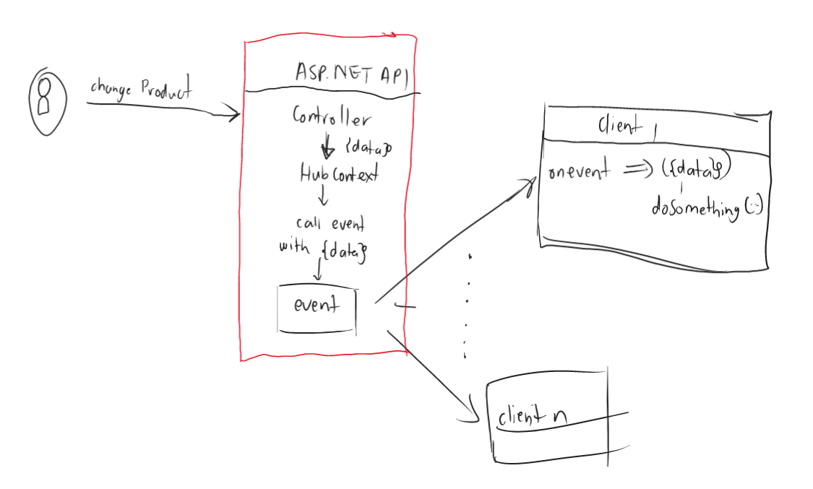

<!--truncate-->

Hello there it's been a while since I did a blog post. In this post I will be looking into SignalR and it helping us do real time updates!
The code referenced here will be from this [repo](https://github.com/Takobz/signalr-example)

<!--truncate-->

### Topics
- What is SignalR ?
- Why Should I use it ?
- A mini project with concepts: What are Hubs, Events and Methods in SignalR
- Controller Configuration
- Configuring A Client App
- Causing An Event To Fire
- Conclusion

### What is SignalR ?
Before we even start looking at SignalR I think it would be cool to understand what it is and what does it do. 

SignalR is .NET's solution to allow servers to send information to clients as soon the change happens in the server. Both the client and the server can invoke methods on each other. This allows the server to call the client thus tell the client about the changes it is interested in. A client can subscribe to changes, called events.

The image below shows the typical architecture of SignalR:


The image above shows some of the fundamental parts of SignalR. We have a `server` that has SiganlR. Which in turns has a Hub which has Events and Methods. The connection is bi-directional meaning the server can call the client and vice-versa.

A `Hub` exposes our signalR endpoints. It enables clients to communicate with the server and vice-versa.

`Events` are the type of actions that clients can subscribe to. So whenever an event happens in the server a client that is subscribed to it will get notified on change. Note that a client can subscribe to multiple events as we can see client 3 from the image.  

`Methods` these are functions on the server/Hub that can be called from the client side code. The client should provide the appropriate parameters and method name to invoke the correct method. 

:::note
The Hub methods can be used to indirectly cause an event from the client on the server but they are not necessarily for firing events from a client but can be used for that function.
:::

### Why Should I use it ?
There are number of reasons to use SignalR but my number one take is live updates. If you have an app that needs to know of changes as soon as they happen (chat notification or live updates like order tracking) then you might need to consider SignalR.  

Why? Well imagine you have an app that needs live data from your database as soon as the state of the database changes. One way to do this is polling, where your app will call the server every, say 60 seconds. This will definitely work until we have a lot requests to the server and potentially causing many request errors and slowing down our server.  

Another big win is that clients can choose what is important to them and listen to those events and then inform other clients of their changes.  

###  A mini project with concepts: What are Hubs, Events and Methods in SignalR
Now, the action! In this section we are going to explore some key conecpts with code snippets! 🐱‍🏍

#### Problem Statement:
We want to have some frontent clients notified whenever a change happens on a certain table that we have in our database. So differnt client apps can subscribe to a signalR change event of any table they are interested in and we will notify them when there is a change. 

#### Set Up:
The .NET Solution will have an ASP.NET Web API with .NET 7. The frontend will be a simple React App that just listens to events.
The database will be sqlite database, to query the database we are going to use Entity Framework Core. Simple stuff 😉.  

Our server will be our ASP.NET Web API and our client a React App. It is worth a mention that a client app can also be another ASP.NET Web API.

Here is a mini diagram of flow:  


We are simply going to have a controller that does a database table change then uses the Hub to fire an event that a table has changed.

##### Set Up SignalR in ASP.NET:
- In our Program.cs file we need to add our hub dependencies to the service collections with this line: `builder.Services.AddSignalR()`
- Create [Hub folder](https://github.com/Takobz/signalr-example/tree/main/signalr-example/Hubs) in the root of our project called Hubs as I did in my repo
- Inside the folder create a file called `DatabaseHub.cs`. This folder will have our Hub class and interface that describes our events.
- Then in our Program.cs we map a url to our Hub with this line: `app.MapHub<DatabaseHub>("/database-hub")` this means our hub url will be like this `https://localhost:<port>/database-hub`

This should be enough for a set-up no eventing yet but first steps.  

##### Hub Class
A Hub is a server concept in SignalR terms. It simply just represents a signalr server. This will be a normal c# class that extends from `Microsoft.AspNetCore.SignalR.Hub<T>` 

The Type `T` is an interface that has all the events the Hub can expose.

Hub Example:  
```csharp
using Microsoft.AspNetCore.SignalR;

namespace SignalRExample.Hubs;

//Hub
public class DatabaseHub : Hub<IDatabaseHubEvents>
{
    //This is a method, it can be called from the client's code.
    public async Task NotifyAll(string clientName)
    {
       //I can cause an event in here by calling Clients property.
       //or something unrelated to SignalR.
    }
}

public interface IDatabaseHubEvents
{
    //Event we are going to fire when Product table changes.
    Task ProductTableChanged(TableChangeModel changeModel);

    //Event we are going to fire when Person table changes.
    Task PersonTableChanged(PersonChangeModel changeModel);
}

//Just a model
public class TableChangeModel
{
    public string TableName { get; set; } = string.Empty;
    public int ItemId { get; set; }
}

public class PersonChangeModel 
{
    public int PersonId { get; set; }
    public string Name { get; set; } = string.Empty;
    public string Surname { get; set; } = string.Empty;
    public string ChangeReason { get; set; } = string.Empty;
}
```

When an event `ProductTableChanged` is fired, clients that are subscribed to the event will receive a `TableChangeModel` object which has the data TableName and ItemId. 

We will see how that is done on the client side later but for now. This will be enough. I want us to talk about the `Clients` property in Hubs namespace

##### SignalR Hub Clients 
`IHubCallerClients<T> Clients` This property has the ability to call all clients that are subscribed to an event. It also has the capability to group client calls:

- Clients.All - calls all clients that are listening to an event.
- Clients.Groups - calls a certain group of clients

This is what we will use to cause events. We can edit the above code to be like this:
```csharp
public class DatabaseHub : Hub<DatabaseHubMethods>
{
    //Notify every client that subscribed to this event.
    public async Task NotifyAll(TableChangeModel changeModel)
    {
        //Send changeModel to All subscribed clients
        //Note we are causing an Event inside a Method, we don't need to do this all the time
       await Clients.All.ProductTableChanged(changeModel);
    }
}
```
:::note
In this blog we are going to Call all clients for more info on how to scope SignalR events visit this [Microsoft page](https://learn.microsoft.com/en-us/aspnet/core/signalr/groups).
:::


##### Entity Framework Models
We will have simple EFCore models that represent tables in our database.  
- ProductModel:
``` csharp
public class Product : Entity
{
    public string ProductName { get; set; } = string.Empty;
    public string ProductDescription { get; set; } = string.Empty;
}
```
- PersonModel:
``` csharp
public class Person : Entity
{
    public string Name { get; set; } = string.Empty;
    public string Surname { get; set; } = string.Empty;
    public string UserName { get; set; } = string.Empty;
}
```  

- Entity
``` csharp
public class Entity 
{
    public int Id {get; set;}
}
```

For Data Models and set up, please see [Repo](https://github.com/Takobz/signalr-example)

## Controller Configuration 🔥
For us to cause an event to fire we just need to call the `Clients.All.<my-event-function>` So we are going to create a Controller that can be POSTED to and then it will fire an event after a successful insert.  

Here is the Controller:  
```csharp
[ApiController]
    [Route("[controller]")]
    public class SignalRController : ControllerBase
    {
        private readonly IHubContext<DatabaseHub, IDatabaseHubEvents> _dbHubContext;
        private readonly ISignalRDbContext _signalRDbContext;

        public SignalRController(
            IHubContext<DatabaseHub, IDatabaseHubEvents> dbHubContext,
            ISignalRDbContext signalRDbContext)
        {
            //make sure you have registerd IDatabaseHubEvents in the DI container
            //i.e services.AddSingleton<IDatabaseHubEvents, DatabaseHub>()
            _dbHubContext = dbHubContext;
            _signalRDbContext = signalRDbContext;
        }

        [Route("add-person")]
        [HttpPost]
        public async Task<IActionResult> AddPerson(string name, string surname)
        {
            var person = new Person
            {
                Name = name,
                Surname = surname,
                UserName = $"{Guid.NewGuid()}"
            };

            DatabaseResult<Person> result = _signalRDbContext.AddPerson(person);
            if (result.Status == Status.Success)
            {
                var changeModel = new PersonChangeModel
                {
                    PersonId = person.Id,
                    Name = person.Name,
                    Surname = person.Surname,
                    ChangeReason = "New Add"
                };

                //Calling all clients and giving them the change model.
                await _dbHubContext.Clients.All.PersonTableChanged(changeModel);
                return Ok("User Added and alerted subscribers!");
            }

            //generates appropriate response based on database result
            return Conflict();
        }
    }
```

In the above we register our Hub via `IHubContext` interface and our `DbContext` that is behind an interface. The important line here is:   
`await _dbHubContext.Clients.All.PersonTableChanged(changeModel);` this lines calls subscribed clients by firing an event `ProductTableChanged` thus passing down the `PersonChangeModel` data to be used by all the subscribed clients.  

And that's it, that's how you fire an event. For all the controller source code check out: [SignalR Example Repo](https://github.com/Takobz/signalr-example/tree/main/signalr-example/Controllers).

## Configurig A Client App
I will be using a React JS client but the concept should be the same for any other client app. This means we will need to install the package: `npm install microsoft/signalr`.
#### Subscribing To An Event.
Clients subscribe to a hub event by specifing the hub `url` and the `event` they are interested in. This would be any event specified in your client's event interface, in my case any method specified in they `IDatabaseHubEvents` interface of my database Hub would be an event.

Let's see how the client app does it:  

I created a service class to take care of my SignalR connectivity [SignalRHubService](https://github.com/Takobz/signalr-example/blob/main/signalr-example-client/client-app/src/Services/SignalRHubService.js). The class looks like this:
```js
import * as SignalR from "@microsoft/signalr";

class SignalRHubService {
  connection = null;
  tableEvents = ["PersonTableChanged", "ProductTableChanged"];

  startConnection = (serverHubUrl) => {
    this.connection = new SignalR.HubConnectionBuilder()
      .withUrl(serverHubUrl)
      .configureLogging(SignalR.LogLevel.Information)
      .build();

    this.connection.start().catch((error) => {
      console.error(error);
    });
  };

  addTableChangeListner = (tableEvent, callback) => {
    if (this.isEventAndConnectionValid(tableEvent, this.connection)) {
      this.connection.on(tableEvent, (tableChangeModel) => {
        callback(tableChangeModel);
      });
    } else {
      console.error("Can't Add Listner with Invalid Connection or Event");
    }
  };

  isEventAndConnectionValid = (tableEvent, connection) => {
    if (!connection) {
      console.error("Can't Add Listner with Invalid Connection");
      return false;
    }

    if (!tableEvent.includes(tableEvent)) {
      console.error("Can't Add Listner For unknow event");
      return false;
    }

    return true;
  };
}

export default SignalRHubService;
```

##### Start Connection
The function that is responsible for starting a SignalR connection thus creating a subscribtion to my signalR Hub is `startConnection`:  
``` js
//serverHubUrl is the URL of SignalR server.
//In this example it will be the server that Host my ASP.NET Web API that has SignalR configured.
startConnection = (serverHubUrl) => {
    
    this.connection = new SignalR.HubConnectionBuilder()
      .withUrl(serverHubUrl)
      .configureLogging(SignalR.LogLevel.Information)
      .build();

    this.connection.start().catch((error) => {
      console.error(error);
    });
  };
```
In the above example we are just building our SignalR connection. The SignalR class comes from the `microsoft/signalr` package. I pass the `serverHubUrl` this will the url where my SignalR Hub Server is hosted, the url must have the path to the Hub. As we will see in my [App.js](https://github.com/Takobz/signalr-example/blob/6c7dac4bb9df64629fe157ed900f6d8b5dc94824/signalr-example-client/client-app/src/App.js#L11C77-L11C77) I used the url `http:localhost:5078/database-hub` as I have configured my .NET Web API to use path `database-hub` for signalR.  

In my App.js I will just start a connection like this: `signalRHubService.startConnection("http://localhost:5078/database-hub");`

If you check your Networks in dev tools, you will see something similar:


This indicates that the connection to the hub has been established. Now subscribing to an event.

##### Subscribing To An Event
The function that is responsible for subscribing to an event is [addTableChangeListner](https://github.com/Takobz/signalr-example/blob/6c7dac4bb9df64629fe157ed900f6d8b5dc94824/signalr-example-client/client-app/src/Services/SignalRHubService.js#L18C3-L18C25):

``` js
addTableChangeListner = (tableEvent, callback) => {
    if (this.isEventAndConnectionValid(tableEvent, this.connection)) {
      this.connection.on(tableEvent, (tableChangeModel) => {
        callback(tableChangeModel);
      });
    } else {
      console.error("Can't Add Listner with Invalid Connection or Event");
    }
  };
```
This function takes in the event name which in my case can either be `PersonTableChanged` or `PersonTableChanged` then a callback method to handle the event. So when event `PersonTableChanged` happens the server will send a `PersonChangeModel` as described in the `IDatabaseHubEvents` the callback function will receive this object and do some work on it.

Here is how I handle an event in [App.js](https://github.com/Takobz/signalr-example/blob/6c7dac4bb9df64629fe157ed900f6d8b5dc94824/signalr-example-client/client-app/src/App.js#L12C68-L12C85):

``` js
  //changes has all changes that happened since we subscribed to the person table changes.
  //useState is a React function for creating state variables.
  const [changes, setChanges] = useState([]);

  const signalRHubService = new SignalRHubService()

  //useEffect is React's method for doing side effect work like calling APIs inside our component.
  useEffect(() => {
    //create connection
    signalRHubService.startConnection("http://localhost:5078/database-hub");
    //listen to event and update my state variable - changes.
    signalRHubService.addTableChangeListner("PersonTableChanged", (personChangeModel) => {
      setChanges((prevChanges) => [...prevChanges, personChangeModel]);
    });
  }, []);
```

In above we subscribe to an Events Hub hosted in my .NET Web API then we listen to any changes of the `PersonTableChanged` event.

Then in my [App.js](https://github.com/Takobz/signalr-example/blob/6c7dac4bb9df64629fe157ed900f6d8b5dc94824/signalr-example-client/client-app/src/App.js#L23) I list the changes that have happended:

``` js
<div>
        <ul>
          {changes.map((change, index) => {
            return (
              <li key={index}>
                <b>Id:</b> {change.personId} <b>Name & Surname:</b> {change.name} {change.surname} <b>Change Reason:</b> {change.changeReason}
              </li>
            );
          })}
        </ul>
      </div>
```

This is how the list would look like (Don't judge my UI skills please! 😂):


## Causing An Event To Fire 🚀
For us to receive any events will need the following:
- Run .NET Web API (using my localhost) by running `dotnet run` on my .NET CLI in directory that has my [signalr-example.csproj](https://github.com/Takobz/signalr-example/blob/main/signalr-example/signalr-example.csproj)
- Run React App by running `npm start` in my command line, result:

- In Postman I will call my Web API to add a user:

- Calling the Web API will create a new Person and then fire the `PersonTableChanged` event:

- The Client will receive an alert of the change:
 

If you notice you can see my Hub sent the client app the name and parameters of the event. It did this via a WebSocket connection that was enstablished when we connected my client to the Hub. SignalR chooses the most optimal connection to make the client server communicate bi-directionally. [Here is Microsoft's word](https://learn.microsoft.com/en-us/aspnet/core/signalr/introduction?view=aspnetcore-7.0#transports) on this!

## Conclusion
In this blog post we covered:
- What is SignalR
- What are Events, Methods, Hubs, Clients.
- How to connect a client to a hub server
- Listening to events from server in a client application.

We didn't talk about invoking methods on the server from the client. [Here's a word from Microsoft](https://learn.microsoft.com/en-us/aspnet/core/signalr/javascript-client?view=aspnetcore-7.0&tabs=visual-studio#call-hub-methods-from-the-client) about this. I was just cautious that this will be lengthy blog.

Here is the [Github Repo](https://github.com/Takobz/signalr-example/tree/main) with all the code

Anywho humans (and machines 🤖) until next time, keep pretending until you are not. Happy Coding. Bye!
