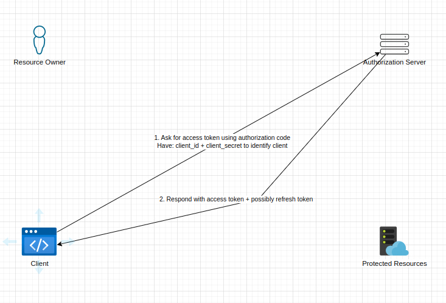
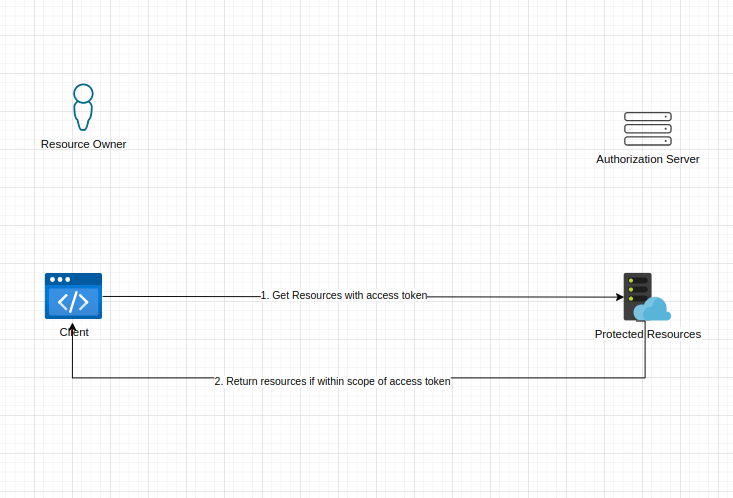

<!--truncate-->

Hello there, I recently started reading about OAuth and trying to understand it as a framework idenpendent of a coding framework/SDK/Package and/or 3rd party offerings.  
In this post I will be talking about the OAuth Authorization Code Flow and why I think it is just an amazing framework for delegating user data, sit back and relax as we pretend our way through OAuth.  

### Topics
- [What is OAuth?](#what-is-oauth)
- [Actors In OAuth](#actors-in-oauth)
- [Problem OAuth Is Solving](#problem-oauth-is-solving-replaying-password)
- [OAuth Flow: Authorization Code Flow](#oauth-authorization-code-flow)
- [How Authorization Code Flow Works](#how-authorization-code-flow-works)
- [Getting Authorization Code](#1-getting-authorization-code)
- [Getting The Access Token](#2-getting-the-access-token)
- [Calling the Protected Resource](#3-calling-the-protected-resource)

### What is OAuth?
Open Authentication commonly referred to as OAuth is a means of authenticating an application to access a resource owner's data from a different application.
It provides a standardized framework that allows this data sharing to be secure, easily adoptable and easily extensible, while providing flows that make sense for different use cases like mobile, native or web applications to name a few.  

To understand what is OAuth we will need to travel a while back in time and see what kind of problem OAuth was trying to solve in the first place.

#### Actors In OAuth
In this small section I will just add terms to some actors that are involved in OAuth:

- `Resource Owner` - This is the person/entity that owns the data we are interested in.
- `Client` - This is the application that wants to access the resource owner's data. An example would be an application that wants to view your Spotify data to maybe show most played songs in the last week.
- `Authorization Server` - Is an important piece in OAuth, this is the component that is responsible for authenticating the resource owner and issuing out tokens to client applications.
- `Protected Resource` - This is where the requested data resides, this will be thought to be an REST API in this blog post.

We will come back to these later and explain their role in OAuth for now let's keep the terms in mind. Now let's look at how exposing a resource owner's data in another application looked like before OAuth.

#### Problem OAuth is Solving: Replaying Password
In the olden days if a client wanted to access data on behalf of the user, the user would need to give their password and username to the client so that the client can replay signing in as the user as shown below:

This has a lot of security implications what if the client loses your credentials and they end up in the wrong hands?

Another security implication would be the resource application has no way of distinguishing between the resource owner and the client. Another one is, since the client signs in as the resource owner, they also have access to resources that they shouldn't and can perform more actions like deleting, modifying and sharing resources when they shouldn't.

The above problem is one the big reasons OAuth was implemented: for scoping application's permissions on the resource owner's content and making sure there is no credentials sharing that can expose the resource owner to potential malicious acts.

## OAuth: Authorization Code Flow
In OAuth we have different ways to implement delegation of the resource owner's data, this is usually refered to as an `OAuth Flow`. Different flows are useful for differnt user cases, we will be looking at the [authorization code flow](https://datatracker.ietf.org/doc/html/rfc6749#section-1.3.1). This flow is useful for Web Application that want access to the resource owner's content, it's ideal if the Web Application doesn't run on the browser like a SPA application or isn't a native application, this is more suitable for REST APIs or server rendered web apps.

:::note
The reason Authorization Code Flow is useful for Web Apps running on a remote server is because there is some compile time configuration like client secrets that the server needs to have in order to exchange it's code for an access token. This can be hard to be achieved in javascript clients running on the browser because we can't hide these secrets from the browser, please see [Implict Grant Flow](https://datatracker.ietf.org/doc/html/rfc6749#section-1.3.2) for this use case or we can use `Dynamic Client Registration` to generate secrets at runtime.
:::

### How Authorization Code Flow Works
In the simplest terms for this flow to work, the resource owner has to authorize the client's request to access their data. The client should know what kind of rights (scopes) they need. When they have been authorized a code will be given to the client known as the `authorization code`.  
The client will then need to ask the authorization server to exchange the authorization code with an `access token`. An access token will then allow the client to send a request to the `Protected Resources` endpoint.

This is just a simple overview let's see how that can be achieved. With the below diagrams. We will talk through each important processes piece by piece to form the whole picture.

For the below example we will assume the client is using the browser to communicate with the other actors and the client is registered to use the OAuth capabilities offered by the authorization server and protected resources endpoints. This means the client has some identity and configurations against it in the authorization server.

#### 1. Getting Authorization Code:

- Firstly the resource owner will be asked by the application if they want the client to get resources on their behalf.
- If they agree then step 1 is done.
- The client will then redirect the resource owner to the Authorization Server with the following query parameters: `client_id`, `scopes`, `redirect_uri` and `response_type`appended on the redirect url.
- the `response_type=code` indicates to the authorization server that the clients wants a authorization code thus using the authorization code flow.
- The client will have had the `client_id` issued to them by the authorization server when the client registered to use the protected resources OpenAPI.
- When the resource owner is redirected to the Authorization Server they will be asked to authenticate themselves with the authorization server, this all happens without the client application seeing anything thus no way to see the resource owner's credentials.
- Once authenticated the resource owner will be presented with a page that shows the `scopes` that the client application needs to in order to perform whatever tasks it wants, at this point the resource owner can approve or reject this request.
- If approved the authorization server will redirect the resource owner to the client's `redirect_uri` and append the authorization code on the url with the parameter `code` that will have some opeque code like `code=sgysbcAhbdfj...` which is authorization code.
- The `redirect_uri` will have been the same redirect_uri sent on step 2 and the same as the one the client configured when it registered to use the OpenAPI. This adds a level of security because the authorization server will always redirect to the url the client knows and can read from, not that just anyone can inject their own redirect_uri.
- The client doesn't need to understand the authorization code it just needs to know how to use it, that is exchange it for an access token.

As seen above the client application and the authorization server communicate indirectly through redirects with the browser being the middle man. This separation is essential to OAuth because it makes the client a simple component in the framework and gives all the authentication and authorization related functionality to the Authorization Server.

:::note
In the above example we didn't use the `state` parameter when redirecting the resource owner to the authorization server from the client application. The state parameter is a random string created by the client application. The authorization server should return this state value as-is unchanged on the redirect to the client application to help the client verify if the response from the authorization server has been untermpered with. This helps with preventing [Cross-Site Request Forgery (CSRF)](https://datatracker.ietf.org/doc/html/rfc6749#section-10.12) attacks, please see the [specification](https://datatracker.ietf.org/doc/html/rfc6749#section-4.1.1) for more info.
:::

#### 2. Getting The Access Token
Once a client has the authorization code, the client will need to trade this for an access token. The client will typically have some kind of identity i.e. `client_id` and some `client_secret` that will be sent along with the authorization code. This will help the Authorization Server identify the client if it is to be trusted to be given the access token. Here is the flow:

- The client would have extracted the authorization code from the redirect respond in [getting-authorization-code](#1-getting-authorization-code) 
- Then send an HTTP request to the Authorization Server with it's `client_id` and `client_secret` as form of identitification. How this identification is done i.e. HTTP Basic Auth or some flow like client credentials, doesn't really matter as long as there is this identification.
- The Authorization Server will process the request and do some checks to verify the code is still valid and check if the client is who they claim to be.
- If all is well an access token we will be sent back to the client with some extra data like `expiration time`, `refresh token`. What kind of extra data the Authorization Server returns is totally up to the Authorization Server.
- Once the client receives the access token which like the authorization code is opeque to the client, the client will be ready to make calls to `Protected Resource`.

A nice thing about this flow is since the access token and authorization code is opeque, the client doesn't even know which user it is delegating for because it doesn't need to. It knows that it needs an access token that the Protected Resource can understand. This again just shows how OAuth has made the client as dump as possible to the point it can't easily leak or see the resource owner's sensitive information.

Another thing is since the Authorization Server oversees the access/auth responsibility the resource owner only needs to go to one place to revoke the access if needed. Now that is good security right there.

note:::
The client would have registered with the Authorization Server so that it can be able to delegate calls for the resource owners. Apon registration a `client_id`, `client_secret` and `redirect_uri` are configured for the client in the Authorization Server in some sense like manually, developer portal, etc.
:::

#### 3. Calling the Protected Resource
Now that the client has the access token it can then use it to get the protected resources scoped to what `scope` was requested in the intial call to create the authorization code. The `Protected Resource` endpoints will have enough context to know which user the access token is for and what kind of data can the client ask for. The Protected Resource can even do extra validation to make sure the access token hasn't expired or been tempared with.

Here is the diagram:

- The client will send a request to perform an action (read, edit, write, delete) with an access token attached to the request.
- If the action is within the scopes of the access token and the access token is still valid, the Protected Resource will respond gracefully and fufil the request.
- If the action is not within the scopes of the access token or the access token is not valid the Protected Resource will have to kick back.

This will be all to get resources on behalf of a resource owner with OAuth's Authorization Code Flow.

## Conclusion 
This is it for now, I think this gives us a better view of how OAuth works and yes, we didn't touch on other OAuth flows like Implict Grant Type, Client Credentials, PKCE flow. But hopefully this gave us a view on what OAuth is, what problem is it solving.

Just a recap, here are the points we touched on:
- OAuth is a framework designed to allow resource owners to give access to client applications to access their data in a controlled manner.
- OAuth is built on HTTP and relys on technologies like redirects to create separation of what one actor can see, namely the resource owner and client application.
- OAuth has flows or different implementation and Authorization Code Flow is one of them, this flow relys on a client creating an authorization code that describes the scope on which an access token will be scoped to, thus what actions can be performed with it.
- OAuth introduces an Authorization Server which is responsible giving access token as of the user's consent.

This is not the most detailed walk through of OAuth, if you are really interested in the indepths of the framework I'd suggest the following references:
- [OAuth 2.0 in Action](https://livebook.manning.com/book/oauth-2-in-action) book
- [OAuth RFC Specification](https://datatracker.ietf.org/doc/html/rfc6749)
- [Okta blog](https://developer.okta.com/blog/2017/06/21/what-the-heck-is-oauth) has a overview of this
- [OAuth](https://oauth.net/2/) has a good compiled sources

I am hoping in the next blog post I will build a mini OAuth ecosystem just to see how this can be translated in code but until then keep pretending until you are not and happy coding.🚀