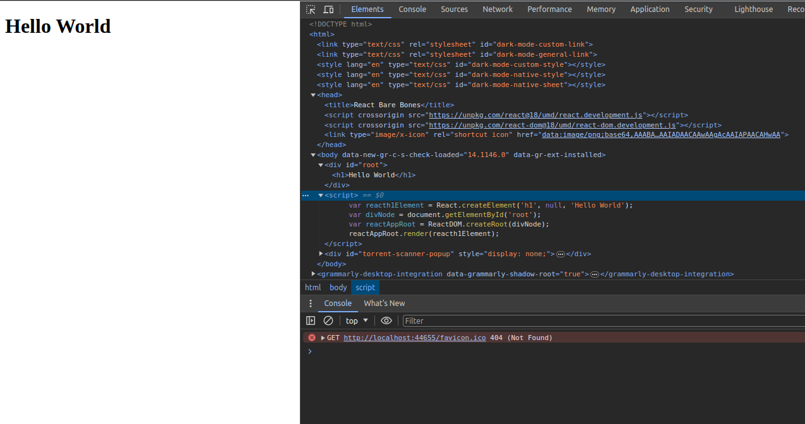

# React Bare Bones

Welcome to another blog post on Let's Pretend Blog! In this post, we will look at ReactJs as it is, without the create-react-app template. Just a mini blog to appreciate why ReactJS is purely just an abstraction of the DOM object and see how a simple component can be built.

## Topics
- Introduction
- What is React, from a library viewpoint?
- If Not A Framework then WHAT IS REACT?
-  Making my React App
-  Conclusion
  
## Introduction

React is a popular JavaScript library for building user interfaces. It allows developers to create reusable UI components and efficiently update the UI when the underlying data changes.

Let's get started!

## What is React, from a library viewpoint?
I have had problems with understanding why people would refer to React as a library and not a framework and knowing my little lack of knowledge of front-end technologies, I'd just not stress myself being such conversations. You'd hear people say "React is not a full framework, I don't like working with it" or "Angular is better it's feature-rich, it has routing built into, a clear design in mind (MVC)"  

And I'd be confused until I met this beaut here [React Quickly](https://www.manning.com/books/react-quickly-second-edition). Then I got a clear understanding of what React is.

## What Problem Is React Solving?
As mentioned in the introduction React focuses on building reusable UI components that change as the state of the data changes, what does this mean? It just means React isn't a framework that is there to help with state management, routing, etc. It is just a means to have reusable and dynamic UI, that's about it.  

Yes react can be extendible with other libraries like `React Router`, and `Redux` to name a few. These libraries along with React can form an ecosystem that can mimic and compete with fully fleshed UI frameworks like Angular and Vue.Js.

This is one of the reasons the model of React is state-centric, by this I mean the interactivity of UI components built in React is tightly coupled with the state changing, hence [hooks](https://react.dev/reference/react/hooks) like [useEffect](https://react.dev/reference/react/useEffect) have things like dependencies to fire the hook whenever data changes.  

## If Not A Framework then WHAT IS REACT?
To demonstrate fully what is react, we are going to build a mini project that will just show us how we can run react without the famous and useful `create-react-app` package which templates our application and helps create a web server for us and also creates a beautiful folder structure for us.

To start please create an empty HTML file in a directory, I named my directory `react-bare-bones` and have an index.html file such that I have the directory path `react-bare-bones/index.html`.

preferably have `Node.Js` installed (we will need it for our web server but any server can be used). This is how my HTML file will look like:
```html
<!DOCTYPE html>
<html>
<head>
    <title>React Bare Bones</title>
</head>
<body>
    <div id="root"></div>
</body>
<script>
    //where my React code will be
</script>
</html>
```

#### ReactDom and React libraries.
For us to have React capabilities on our website we would need to import the following libraries: [ReactDOM](https://unpkg.com/react-dom@18/umd/react-dom.development.js) and [React](https://unpkg.com/react@18/umd/react.development.js). These two classes/libs are important for the following reasons:
- The `React` class helps us with the capability to create React elements these elements may be well-known HTML elements like `h1`, `p`, `div`, or our custom components.
- The `ReactDOM` class creates an abstraction of the DOM object and helps create the root container of our React application, that is, a container where all our React-rendered elements/components will reside. It also has the render method that will render our app in the DOM.

To add these two classes in our HTML file, which we use adding React to our website would require us to add this in our header tag:
```html
<head>
    <title>React Bare Bones</title>
    <script crossorigin src="https://unpkg.com/react@18/umd/react.development.js"></script>
    <script crossorigin src="https://unpkg.com/react-dom@18/umd/react-dom.development.js"></script>
</head>
```

:::note
I know I used the word element to define the HTML tags like h1 and p. In React any small building block that can be reused and created via the React.createElement(...) (which we will see in action) is referred to as an element/component.  
:::

## Making my React App
In this section, we will add some React into our app and can't create a simple Hello, World Website. Assuming you have added the cdn references to the `index.html` file we can proceed to add our React code in the script.

#### React Element
To create the React element we will add the following line in our script:

```js
var reacth1Element = React.createElement('h1', null, 'Hello World');
```

The createElement takes in three arguments:
- `type` is a string that represents a component that we want to render like `h1`, `div`, `p`, or our custom component.
- `data` would represent the data we want to pass to the component/element. This is also referred to as props, short for properties. In this mini example, we don't need props hence the null.
- `...children` is the list of children of the component in this case the h1 tage would have the text as the only child.

This would allow us to create a React element but we need a place to render this element.

#### Rendering the React Element.
To render the element we will need a container to place our React application, we will use our `div` with `id="root"` like this:
```js
var divNode = document.getElementById('root');
```
This is a just vanilla javascript line to get the div's object instance in the DOM.

Will then need to set this as the root element in our React virtual DOM using this line:
```js
var reactAppRoot = ReactDOM.createRoot(divNode);
```

This will create our React App Node but if we were to run our web server now, nothing would be rendered because we just created the root but didn't render it on the DOM, to do so we will do the following:
```js
reactAppRoot.render(reacth1Element);
```

The render method takes in a react element to be displayed.

The complete file would look like this:
```js
<!DOCTYPE html>
<html>
<head>
    <title>React Bare Bones</title>
    <script crossorigin src="https://unpkg.com/react@18/umd/react.development.js"></script>
    <script crossorigin src="https://unpkg.com/react-dom@18/umd/react-dom.development.js"></script>
</head>
<body>
    <div id="root"></div>
</body>
<script>
    var reacth1Element = React.createElement('h1', null, 'Hello World');
    var divNode = document.getElementById('root');
    var reactAppRoot = ReactDOM.createRoot(divNode);
    reactAppRoot.render(reacth1Element);
</script>
</html>

```

The above would be enough to get your React app running, but first, we need to create a web server to host our beautiful website.

#### Web Server with Node.Js
I have Node installed in my machine so I will just use that to host my site. Here's how I will do it:
- open the terminal in my working directory, i.e. directory with `index.html`
- run `npx serve` this will serve up the HTML in the working directory.
- A URL with a port number will be shown in the terminal that you can follow and see your website.

The Result should be something like this:


As you can see the `div` now has the h1 tag and we didn't template this or write it in a markdown format just pure Javascripting!! and no `react-create-app`.

:::note
React uses what we call [JSX](https://legacy.reactjs.org/docs/introducing-jsx.html) to create react elements in an XML-like syntax, this is pure javascript that looks like XML. It is mostly used instead of using React.createElement. I didn't focus on that here because I wanted to show the appreciation of React just being a javascript UI library and nothing more.
:::


## Conclusion.
Just to close this, here's a quick recap of what we covered:
- React is a library and not a framework.
- React focuses on building dynamic UI components.
- You just need JavaScript and the relevant libraries that have ReactDom and React to build your web app.
- react-create-app is a template library and not part of React.

Until next time! keep pretending until you are not 😁. Bye!!
