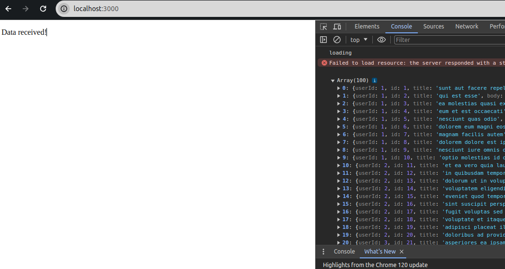
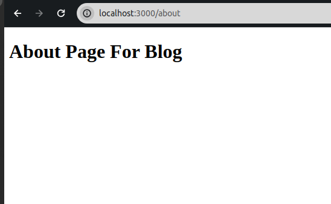
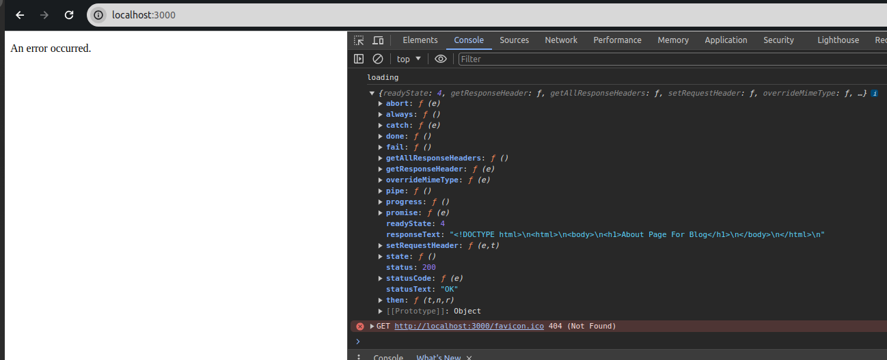

Hello There (General Kenobi). In this blog post we will be looking at how JQuery's AJAX call can think your successful AJAX calls are not successful only because of the dataType you used when calling a remote API.

<!--truncate-->

## Topics
- What is JQuery and AJAX.
- Doing an AJAX call with JQuery.
- JQuery "mistaking" your success as error
- The "fix"
- Conclusion


### What is JQuery and AJAX.

#### What is JQuery?
Well in the world of web development [JQuery](https://jquery.com/) is pretty famous it is a library that allowed web developers to make their websites more dynamic and do edgy stuff without doing a lot of vanilla javascript, yes there was still a lot of heavy lifting were they needed to do a lot of work for themselves when manipulating the DOM.  

JQuery was (and still is) amazing because it allows you to use selector to manipulate DOM elements like divs, p1, h1, etc. It also has capabilities to insert html into the DOM with the `.html(data)` function where data is any html you want to insert.  

Apart from that JQuery allowed developers to change styling on the fly as they need to with the help of the `.css()` function. Below is an example of how we can use JQuery by simply just changing the text of a div and inserting some h1 tag:

```html
<!DOCTYPE html>
<html>
<head>
    <script src="https://ajax.googleapis.com/ajax/libs/jquery/3.5.1/jquery.min.js"></script>
    <script>
    $(document).ready(function(){
        $("#myDiv p").text("This is the new text for the paragraph.");
        $("#myDiv").append("<h1>This is a new H1 heading</h1>");
    });
    </script>
</head>
<body>

<div id="myDiv">
    <p>This is a paragraph.</p>
</div>

</body>
</html>
```

JQuery uses selectors to find elements in the DOM. To find any element with and id we use the hash symbol (#) in my example because my div has id myDiv to select that element using JQuery I just go `$("#myDiv")` you can even store this in a variable and console.log() it to see how a DOM element looks. In the above example the first line in my script finds my div by id then looks for any p child inside the div then changes the text using the `.text()` method.  

A line later I use the `append()` method to append a child to my div this will add a new h1 tag to my div. This is just a simple example to try and show you how JQuery works, you can copy the HTML then serve in any web server you like locally and you will the result 🙃

:::note
You may have noticed the use of `$(document).ready(function(){...})` in the example, this is best practice as it lets JQuery wait for the DOM to be ready before starting to manipulate it, it is best practice to have your JQuery inside of the function if you want your JQuery to execute as soon as the DOM is fully loaded otherwise in the case of creating, say, onclick event functions that will be used when you click a button then it's okay because your function will run when the DOM is loaded i.e. when you are able to click buttons etc.
:::

:::tip
Make sure you always import your jquery first from you cdn then followed by the script that uses JQuery as seen in my head tag of my html document. This is because the JQuery function `$` wouldn't have been loaded if you start with a script that JQuery dependency.
:::

#### What is AJAX?
AJAX stands Asynchronous Javascript And XML. It is used for sending HTTP request to the server from your web app in manner that doesn't load up the whole page, it is useful for sending requests then dynamically changing your page.  

With plain javascript a AJAX object can be initialised using the new keyword as follows: `var xhttp = new XMLHttpRequest();`.

##### JQuery's AJAX
JQuery has a way to use AJAX functionality without needing to initiliaze the `XLMHttpRequest` which becomes tedious real fast. To do that we have a `$.ajax({...})` where we give our ajax method some values as follows:
```html
<!DOCTYPE html>
<html>
<head>
    <script src="https://ajax.googleapis.com/ajax/libs/jquery/3.5.1/jquery.min.js"></script>
    <script>
    $(document).ready(function(){
        $.ajax({
            url: "https://jsonplaceholder.typicode.com/posts",
            method: "GET",
            dataType: json
            beforeSend: function(){
                console.log("loading")
            },
            success: function(result){
                console.log(result);
                $("body").append("<p>Data received!</p>");
            },
            error: function(error){
                console.log(error);
                $("body").append("<p>An error occurred.</p>");
            }
        });
    });
    </script>
</head>
<body>
</body>
</html>
```

I served the above HTML with `npx server` and got the follwing result:


The json we passed in the `$.ajax({...})` method had the following properties and here's what they mean:
- url: this is url where we want to send our call.
- method: HTTP method like GET, POST, PUT and DELETE
- dataType: the expected data type from call
- beforeSend: function that will be executed right before sending the call.
- success: function to execute on success. This includes call with 2xx, 3xx.
- error: function to execute non success calls or failures to read/process responses. Example: 4xx, 5xx.

:::tip
If you need to specify certain headers in your AJAX call you can specify header prop in the obbject passed to the $.ajax method.
:::

### JQuery "mistaking" your success as error
If you can notice I pust mistaking in qoutes because it's not really mistaking, either way let's see how that happens.

#### Cause of "mistaking" success with error 
There is case that is easy to miss that may cause JQuery AJAX call to think a success call is failure. **This happens when we specify the wrong dataType**.  

So if I am expecting a json response and my server sends me a 200 HTTP Status Code with html content this will classified as an error but there won't be any log to let me know. The reason this becomes an error is by telling JQuery you expect json it will try to parse the response for you and if it fails even though the response 200 OK, it will just go to the `error function`. 

To illustrate this, I have create an html page that just has an h1 tag as follow:
```html
<!DOCTYPE html>
<html>
<body>
<h1>About Page For Blog</h1>
</body>
</html>
```
Which simply shows this:


This will be hosted on localhost:3000 same as my html with JQuery. Then I will do a call where I specify `dataType: json` then do a call to get this new page. It's as follows:
```html
<!DOCTYPE html>
<html>
<head>
    <script src="https://ajax.googleapis.com/ajax/libs/jquery/3.5.1/jquery.min.js"></script>
    <script>
    $(document).ready(function(){
        $.ajax({
            url: "/about",
            method: "GET",
            dataType: "json",
            beforeSend: function(){
                console.log("loading")
            },
            success: function(result){
                console.log(result);
                $("body").append("<p>Data received!</p>");
            },
            error: function(error){
                console.log(error);
                $("body").append("<p>An error occurred.</p>");
            }
        });
    });
    </script>
</head>
<body>
</body>
</html>
```
The result:


As you can see the `responseText` which serves as the content of the response is an html about page and `status` is OK from the part we logged in the console, yet our function goes to error hence we see our body appended with **An error occurred** message. 

Again this because we told JQuery: "hey, I am sending an HTTP request and the server must give dataType json as a response". Then JQuery tries to be nice and parse your responseText for then fails, hence calling the error function. So how do we fix this?  

:::note
Before fixing, I'd like to add that, this isn't a bug by JQuery but rather a feature to make sure your data returned is what you expected so you can maybe do some operations on the JSON response and this again highlights something. The error function is not a function only for failed calls i.e. 500, 400 etc. It is also called by JQuery for process/parse failures so it's good to keep that in mind.
:::

### The "fix"