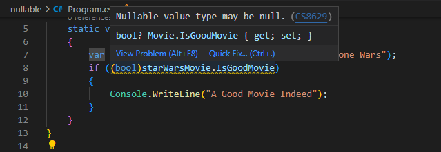
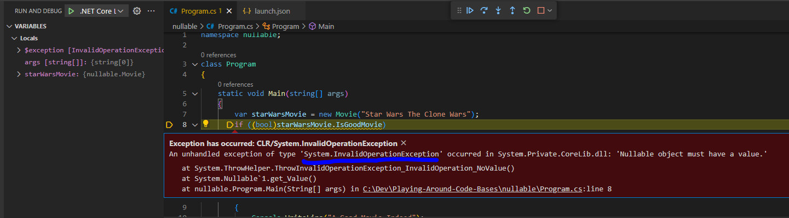

Hello There, In this blog we are going to talk about the dangers of casting nullable booleans in C#. This was an actual bug in some codebase I worked on and it took a while to find (also not a unit tested scenario but was tested manually).

<!--truncate-->

## Topics
- What is a Nullable boolean
- Casting Warning.
- How To Get Around the Cast Possible error.
- Conclusion.

### What is a Nullable boolean
In the world of coding we say a data type or structure is nullable if it can contain a null value (to an extent). This means that I can use null in place of this datatype and my program won't complain, in C# you would see something like the below:
```js
public class MyClass
{
    //Can be written as public Nullable<int> NullableInteger { get; set; }
    public int? NullableInteger { get; set; }   //can assign null here
    public int NotNullableInteger { get; set; } //can't be assign null to this.
}
```

In C# we usually use the question mark symbol `?` to make a property nullable. This is useful for some reasons:
- Your code is explict with letting you know this value can possibly be null
- Every nullable property/type in C# is wrapped inside the `Nullable<T>` class
- Nullable types have properties like `HasValue` and `Value` thanks to the Nullable wrapper.

:::note
`Nullable<int>` and `int?` are the same thing. The Nullable wrapper offers ways in which the consumer of data your structure can check if they have a valid value.  
`HasValue` is boolean that is set based on the `Value` property, it indicates were the value of your structure has actual data or null.
Instead of something like `if (myNullableObj != null)` you can go: `if (myNullableObj.HasValue)`. Then the Value property has your value or null.
:::

### Casting Warning.
In our codebase we had a nullable property that we used to check a condition and C# gave us a warning against this.  
To illustrate what we had, lets look at the below:

```js
namespace nullable;

class Program
{
    static void Main(string[] args)
    {
        var starWarsMovie = new Movie("Star Wars The Clone Wars");
        if (starWarsMovie.IsGoodMovie)
        {
            Console.WriteLine("A Good Movie Indeed");
        }
    }
}

public class Movie
{
    public Movie(string movieName)
    {
        MovieName = movieName;
    }

    public string MovieName { get; set; } = string.Empty;
    public bool? IsGoodMovie { get; set; }  = null;
}
```
You can notice I set my `IsGoodMovie` property to have a default value of null, just for the sake of this blog post.
If you have ever used C# before you might know that the above if statement in the Main method will cause the compiler to freak out and your IDE/Editor will scream at you with this error code: [CS0266](https://learn.microsoft.com/en-us/dotnet/csharp/language-reference/compiler-messages/cs0266?f1url=%3FappId%3Droslyn%26k%3Dk(CS0266))  

This will tell you something like `Cannot implicitly convert type 'bool?' to 'bool'. An explicit conversion exists (are you missing a cast?)`. Tempting suggestion, and spoiler alert, we fell for it!  
So essentially the error says, the if-statement expects something like `if(bool)` but you are trying to do `if(bool?)`, because remember our `IsGoodMovie` is nullable it is not a `bool type` but a `bool? type` or you can say `Nullable<bool>`.  

So what do you do then? well we went the casting route and had something like this:
```js
//cast by adding (bool).
if ((bool)starWarsMovie.IsGoodMovie)
{
    Console.WriteLine("A Good Movie Indeed");
}
```
Casting just means forcing an object which type A to be type B. The Language takes care of value conversion, some types are easy to cast some are hard and can cause unexpected results, so not recommended if we don't know what we are getting ourselves into!  

This didn't totally solve our problems we now have a warning with code: [CS8629](https://learn.microsoft.com/en-us/dotnet/csharp/language-reference/compiler-messages/nullable-warnings?f1url=%3FappId%3Droslyn%26k%3Dk(CS8629)#possible-null-assigned-to-a-nonnullable-reference) but we were not phased and didn't pay attention to the implication of this warning.  

The warning was telling us: "Hey, nullables can possibly have null values and you are assuming it is not null here". C# even gives you this beautiful message:


If I run this piece of code, knowing  that my IsGoodMovie is null I will get this runtime exception:


And Oops! Just like that we broke production, yup, BIG NO NO! So this is the danger: **Don't rely on nullables always having a value**.
So we assumed `(bool)null => false` but we got humbled! because this is not the case, the C# Runtime can't change nothing (null) into a valid true/false.

:::danger
Never assume a nullable has a value, the whole purpose of it being nullable is to give the consumer an indication that it may be null.
It is your responsibilty as the consumer to handle for such situations if they do arise.
:::

### How To Get Around the Cast Possible error.
Our fix around this was simple; use the capabilities Nullable provided for us so we change our code to:
```js
static void Main(string[] args)
    {
        var starWarsMovie = new Movie("Star Wars The Clone Wars");
        if (starWarsMovie.IsGoodMovie.HasValue && starWarsMovie.IsGoodMovie.Value)
        {
            Console.WriteLine("A Good Movie Indeed");
        }
    }
```

Now we use `HasValue` to check if the value in IsGoodMovie is a valid boolean if true, we then proceed to check if value is true, only then do we go into our if.  
Simple fix but it has made us aware of something important **DON'T JUST CAST TO GET RID OF ERRORS**.  

:::note
Notice I started my if-condition by checking HasValue because this is an AND operation if the first check fails, then the if-condition fails and we won't accidentally use null.
:::

:::tip
When using an AND if check always start with a less costly operation because if it fails we exit and we will have used little resources and don't need to do the big operation.  
i.e. if (myObject.Property && SomeServiceThatCalculatesStuff()) so if my Property is false we quickly exit and we don't do uneeded calculations that would have led to the same result. This is reffered to as fail fast.
:::

### Conclusion.
Okay, I enjoyed this blog, was nice. Here are the main points:
- Don't assume Nullables have values
- Always use the machinism provided to help with checking nulls.
- Don't just cast because it removes errors.
- Always test your assumptions - tests are good negative indicators.

Until next, keep pretending until you are not.