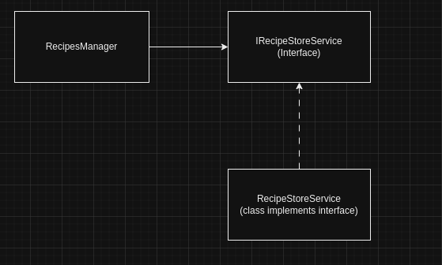
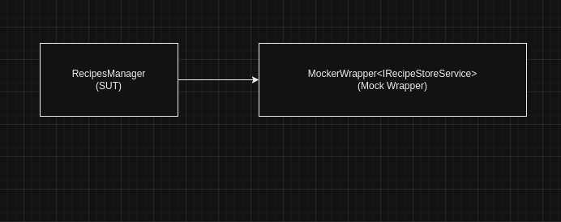
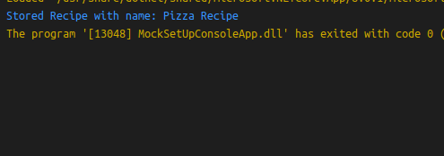
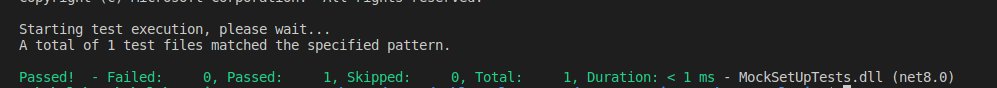
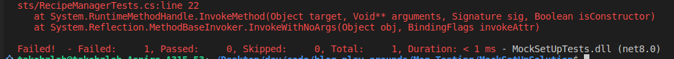

Hello there! On this blog post we are going to talk the dangers of using meaningless data inputs when setting mocks and the possible danger this might cause, hang tight and enjoy! 

<!--truncate-->

## Topics
- What are Mocks?
- Setting up a mock in your unit test using Moq.
- The Good and the Bad of Moq It.IsAny&lt;T&gt;
- Conclusion

:::note
Just a quick a note on terminology used, considering that I have worked most with OPP paradigm, most of the terms I will use will be rooted in that background but hopefully this is useful beyond OOP.
:::

### What are Mocks.
A Mock in the context of unit testing is a module that mimics the behavior of another class/component. These mocks are usually used in Unit tests to replace dependencies that a `System Under Test (SUT)` needs to perform a task. Mocks are useful for giving the tests the same behaviour as the actual dependency would've given us but they are light-weight and depend on some kind of inputs and set up to give us the behaviour we need, good news, we set up those inputs.  

To get a good grasp of what mocks are we going to draw a little diagram and later some code to see how Mocks work using [Moq](https://www.nuget.org/packages/Moq) in a C# XUnit Test Project.  

#### A little scenario
Let's say we have a piece of software that adds recipes to a database using a class called `RecipesManager`. For the RecipesManager to add recipes it needs to use `RecipeStoreService` class that is responsible for saving recipes to some database.

In this scenario we can say **RecipesManager has a dependency on RecipeStoreService** that is, the manager needs the store service for it to fullfil it's functional purpose, i.e. to store recipes to some database.  

This diagram shows the dependency:


:::note
I know in the diagram above I have used an interface instead of the actual implementation, this is in line with the concept known as `Dependency Inversion` where a class is decoupled from it's dependency's implementation which may change over time and cause issues. We usually just have the interface which will likey remain with the same contract even though the underlying implementation may change. To learn more about Dependency Inversion please see [this](https://en.wikipedia.org/wiki/Dependency_inversion_principle)
:::

The above diagram shows the dependency if the software was normally running but in a unit test we might want to replace `RecipeStoreService` with a mock for a number of reasons listed but not limited to them:
- Starting up the original RecipeStoreService can be expensive for unit tests (time/resources).
- Mocking dependencies means we have control of the input thus the behaviours we want from the SUT.
- The dependency graph of the RecipeStoreService can be big (the service has dependencies that have dependencies etc.)

After replacing the RecipeStoreService with a mock we might have something like this:


:::note
The above image represents a relationship between our dependency (RecipeStoreService) with a System Under Test (RecipesManager) in a unit test. Most mock framework like Moq wrap our dependencies using an interface to fake our output for a given input.  
:::

The above replacement results in something like this for a given test case:
- Mock Wrapper when your IRecipeStoreService is called with input A output B.
- We will passed the IRecipeStoreService implementation created by our Mock framework to the SUT.
- When the SUT excutes code that calls our IRecipeStoreService with A then B will be the output.

### Setting up a mock in your unit test using Moq.
So now that we have an idea of what a mock is, let's have the above [scenario](#a-little-scenario) in code and then delve into the reason we have this blog post. Please note I am doing all of this in a simple console application.  

Our Recipe Store will look like this:
```js
//interface for the Recipe Store
public interface IRecipeStoreService 
{
  bool AddRecipe(string recipe);
}

//Implementation
public class RecipeStoreService : IRecipeStoreService
{
    public bool AddRecipe(string recipe)
    {
        //stores the recipe and returns true if successful
        return true;
    }
}
```

Our Manager like this:
```js
public class RecipesManager 
    {
        private readonly IRecipeStoreService _recipeStoreService;
        public RecipesManager(IRecipeStoreService recipeStoreService)
        {
            _recipeStoreService = recipeStoreService;
        }

        public bool AddRecipe(string recipe)
        {
            //does manager responisbilties like validation
            if(_recipeStoreService.AddRecipe(recipe))
            {
                Console.WriteLine("Stored Recipe with name: {0}", recipe);
                return true;
            }
            else
            {
                Console.WriteLine("Failed to store Recipe with name: {0}", recipe);
                return false;
            }
        }  
    }
```

Then we will proceed to have a simple Main method like this:
```js
class Program
    {
        static void Main(string[] args)
        {
            var recipe = "Pizza Recipe";
            var manager = new RecipesManager(new RecipeStoreService());
            manager.AddRecipe(recipe);                
        }
    }
```

This will simply print out this to the console:


This is sweet now, let's test this using Mocks. Just a reminder, we are testing RecipesManager not Program.cs' Main so we won't be looking at that logic. To Start we will need to create an xunit test project like [this](https://learn.microsoft.com/en-us/dotnet/core/testing/unit-testing-with-dotnet-test). I have alreay set up my tests and have a test project called `MockSetUpTests`.  

In There I will have a simple test cases:
```js
public class RecipeManagerTests
{
    [Fact]
    public void AddRecipe_WhenCalled_ReturnsTrue()
    {
        // Arrange
        var recipe = "Pizza Recipe";
        var mockRecipeStoreService = new Mock<IRecipeStoreService>();
        mockRecipeStoreService.Setup(x => x.AddRecipe(recipe)).Returns(true);
        var manager = new RecipesManager(mockRecipeStoreService.Object);

        // Act
        var result = manager.AddRecipe(recipe);

        // Assert
        Assert.True(result);
    }
}
```

This will result in a passing test:


#### How we used Moq to Mock
This is how we mocked the `RecipeStoreService`:
- Created a mock that wraps our service like this: `var mockRecipeStoreService = new Mock<IRecipeStoreService>();`
- Then we proceeded to SetUp our mock for a certain call with this line: `mockRecipeStoreService.Setup(x => x.AddRecipe(recipe)).Returns(true);`
- By setting up we are telling mock if the IRecipeStoreService you created is given input "Pizza recipe" return true, otherwise it would return false and the test fails.
- Then our manager can do whatever with response, in this case it just propagates the value to the caller.

#### It.IsAny
Now let's talk a little about some magic wand, In the case above we see that recipe we pass to the manager will further be used in the store service. This might lead those who use Moq a lot to use this magic wand: `It.IsAny<string>()` which would lead our set up line to look like this:  
```js
mockRecipeStoreService.Setup(x => x.AddRecipe(It.IsAny<string>())).Returns(true);
```

This tells our test **It doesn't matter what string value I give you just return TRUE**. Let's use talk about the danger of this.


### The Good and the Bad of Moq It.IsAny&lt;T&gt;
The Good of It.IsAny is that when we really don't care what value is passed to our dependency we don't need to have a test value for it, the bad? If we care and still use It.IsAny.  

#### The danger
We are going to change our code to show the danger of this, consider our manager changes and we want use  a request Object like this:
```js
public class RecipesManager 
{
    private readonly IRecipeStoreService _recipeStoreService;
    public RecipesManager(IRecipeStoreService recipeStoreService)
    {
        _recipeStoreService = recipeStoreService;
    }

    public bool AddRecipe(RecipeRequest request)
    {
        //does manager responisbilties like validation
        if(_recipeStoreService.AddRecipe(request.Founder))
        {
            Console.WriteLine("Stored Recipe with name: {0}", request.Recipe);
            return true;
        }
        else
        {
            Console.WriteLine("Failed to store Recipe with name: {0}", request.Recipe);
            return false;
        }
    }  
}

    //Request object
public class RecipeRequest(string recipe, string founder)
{
    public string Recipe { get; set; } = recipe;
    public string Founder { get; set; } = founder;
}
```

We now introduced a new Request object but we accidentally stored the Founder name instead of the recipe but because we used the `It.IsAny<string>()` in our code base the test will pass. In our test we just need to add the Request model and pass it in our act statement, the rest should work fine:
```js
 // Arrange
var recipe = "Pizza Recipe";
var request = new RecipeRequest(recipe, "John Doe");
var mockRecipeStoreService = new Mock<IRecipeStoreService>();
mockRecipeStoreService.Setup(x => x.AddRecipe(It.IsAny<string>())).Returns(true);
var manager = new RecipesManager(mockRecipeStoreService.Object);

// Act
var result = manager.AddRecipe(request);

// Assert
Assert.True(result);
```
This would be misleading because now we will think our code works as expected until we run and see otherwise and sometimes such bugs are easy to not see then we have this kind of code in production, so what is the solution? Here's How:

### How To Correctly verify inputs on set.
Moq and most mocking frameworks provide a means to make your test inputs more explict to what they need to perform a task. Moq has `It.Is<T>()` which is helpful to make sure the paramter passed is the value we want, In test we would swap `It.IsAny` for `It.Is` like this:

```js
mockRecipeStoreService.Setup(x => x.AddRecipe(It.Is<string>(c => c == request.Recipe))).Returns(true);
```

Now this tells mock make sure the string passed to AddRecipe is the same as the Request's Recipe parameter if I run my test with this change, I get:



:::tip
Always make sure your mocked dependency have meaningful data so you can avoid such situations.
:::


### Conclusion
That will be it for the blog, pretty lengthy! Here's somethings to remember:
- Mocks are meant to replace dependency for the SUT.
- Always make your set up input data reflect the actual data
- Be explict with your inputs, especially if they are used in important places.