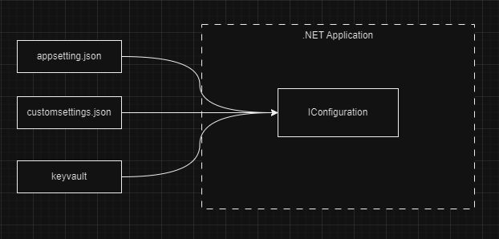

Hello there! On this blog post we are going to look at different ways to read the configuration into your application and what each method implies.  
In the blog post will just be using the appsettings.json as our configuration provider.

<!--truncate-->

## Topics
- Reading the Configuration (Bind, Configure and Configuration[string-value])
- The WebAPI For Testing
- How Each Method Handle Changes.
- What to use?
- Conclusion

All code referenced in this blog post can be found [here](https://github.com/Takobz/).
Microsoft has good documentation on this which can be found [here](https://learn.microsoft.com/en-us/aspnet/core/fundamentals/configuration/options/)

### Reading the Configuration (Bind, Configure and Configuration[string-value])
In this section we will look at different ways we can read in the configuration into a .NET Application.
The following code snippets assume we have an appsetting.json file with this `Secrets:SecretA` structure, as seen below:
```json
{
    "Secrets": {
        "SecretA":"someValue"
    },
    "Key":"Value" 
}
```
We also assume we have a C# class with that structure for binding purposes, as seen below:
```js
namespace ConfigTesting.Models 
{
    #pragma warning disable CS8618
    public class SecretsOptions
    {
        public const string Secrets = "Secrets";
        public string SecretA { get; set; }
    }
}
```

#### Bind Method
With the bind method, we get the section we want from the loaded configuration (in our case the appsettings.json) then we bind that section to an instance of a class that we have created ourselves. For the binding to work the corresponding properties in the class need to have public getter and setter as seen above for `SecretsOptions` class.  

This is how we can bind:
```js
//assuming configuration is IConfiguration/IConfigurationManager which we can access via DI or builder.Configuration
//.NET must have loaded the appsettings.json file by default for us.

//we create an instance then bind it to values in the configuration
var secretsOptions = new SecretsOptions();
configuration.GetSection(SecretsOptions.Secrets).Bind(secretsOptions)

//this will give out the current SecretA value, the one we had at the time of binding
secretsOptions.SecretA;
```

Things to note here are:
- This gets the current loaded configuration and binds values to the class
- If the `IConfiguration` updates values the `secretOptions` **WILL NOT** update.
- This method can be used anywhere in the application where we can have access to IConfiguration.

#### Configure&lt;TOption&gt; Method
The `TOption` generic class in this instance is our class that represents the settings i.e. `SecretsOptions` class.  
With this method we still need to get the section from the configuration but we don't need to bind to any instance as we will be accessing our settings via Dependency Injection.

This is how we read in the config:
```js
// This allow us to get the configuration via the IOptions<TOption>, IOptionsMonitor<TOption>, or IOptionsSnapshot<TOption> interfaces
// This adds our options to the DI container
configuration.GetSection(SecretsOptions.Secrets).Configure<SecretsOptions>();

//Example of usage in other class
public class SomeClass 
{
    private readonly _secretsOptions;
    public SomeClass(IOptions<SecretsOptions> options)
    {
        _secretsOptions = options.Value ?? throw new ArgumentNullException(nameof(options));
    }

    //usage later in the code
    //This will give us the value of SecretA that was loaded from the configuration when IOptions was constructed.
    //The IOption is constructed into the DI container as a singleton, more on this later.
    _secretsOptions.SecretA;
}
```

Things to note here are:
- This method adds our configuration section to the DI container.
- It allows us to get our section with the class IOptions, IOptionsMonitor, or IOptionsSnapshot

#### Configuration[string-value]
Another note worthy method of reading the configuration is using the configuration itself. This works for the IConfiguration which can be accessed via DI.
.NET Automatically adds the loaded Configuration into the DI container. 

This method always get the most recent values from our configuration. When using this method you will get back a string. Using our example json below:

``` json
{
    "Secrets": {
        "SecretA":"someValue"
    },
    "Key":"Value" 
}
```

Assuming I have IConfiguration as a variable then if I go: `config["Secrets"]` will return null since Secrets section is not parsable to a string, but `config["Key"]` we will get value `Value` since it is parsable to a string.

:::tip
To get the whole Secrets section from the configuration you can use `GetSection()`.
```js
IConfigurationSection secretsSection = config.GetSection("Secrets");

//To access values in the section:
//secretA will have a value if SecretA is parsable as a string.
var secretA = secretsSection["SecretA"]; //will have someValue string
```
:::

:::info
Primitive values that can be parsed to strings are int, double, decimal, char, boolean, and string.
The IConfiguration["some-section"] returns null if it can't parse the section, which likely if the section is json object, to which using `GetSection("some-section")` is most appropriate.
:::

So as we can see .NET offers a bunch of options for getting your configuration values from the IConfiguration. Now let's look at how each method handles the changes in the configuration.

### The WebAPI For Testing

In this section we are going to see how a simple miminal API can help look at how each of the methods handle changes that might happen to IConfiguration. Knowing when your configuration changes is important to applications that might have a configuration provider that changes value, like auto rotated secrets in a key vault.

#### Configuration Providers
One cool thing about .NET's IConfiguration is that it can have multiple providers at the same time. To understand what I mean about providers let's look at this diagram:


The diagram shows that a .NET Application can construct a configuration from multiple sources, like `appsettings.json`, `customsettings.json`, and some external service like a [keyvault](https://learn.microsoft.com/en-us/azure/key-vault/general/basic-concepts). We can have as many providers as we want.

These different sources are what we call configuration providers, because they provide values to our configuration. Multiple configurations can be added to our IConfiguration in different ways. The appsettings.json will be added automitically by .NET unless told otherwise.  The configuration

:::info
For more information on how configuration is loaded in a .NET application, please see this [documentation](https://learn.microsoft.com/en-us/dotnet/core/extensions/configuration-providers).
:::

The reason we spoke about configuration providers it's because I wanted to chip in something like keyvault into the conversation, but why? Well because providers like keyvault tend to have values that can change and our application might need to use the latest value and hence we need to have means to be alerted of our the changes so that our application uses the lastest and freshest settings.

Now let's look at our application that will help us test out which method is best for listening to changes in our configuration.

#### The Configuration API.
The code to this api can be found [here](https://github.com/link-to-app). Please note the only provider used in this application is the appsetting.json for the same of simplicity.

##### What the WebAPI Does
The WebAPI providers an endpoint to change a value of a section in `appsettings.json`, the value is `Secrets:SecretA` as seen in the JSON file below:
```json
{
  "Logging": {
    "LogLevel": {
      "Default": "Information",
      "Microsoft.AspNetCore": "Warning"
    }
  },
  "SettingA": "initValue",
  "Secrets": {
    "SecretA": "a-very-secret-value"
  },
  "Key": 1,
  "AllowedHosts": "*"
}
```
The API will be able to update the SecretA value to any value provided.  
The Web API also has another endpoint to get the current value of `SecretA`

The endpoint to update the config value returns a result like this:
```js
public record ConfigChangeResponse
    {
        /// <summary>
        /// The value before the IConfiguration changed
        /// </summary>
        public string OldValue { get; init; } = string.Empty;

        /// <summary>
        /// The value after the IConfiguration changed
        /// </summary>
        public string NewValue { get; init; } = string.Empty;

        /// <summary>
        /// The value of the binded property before the IConfiguration changed
        /// </summary>
        public string BindBeforeChange { get; init; } = string.Empty;

        /// <summary>
        /// The value of the binded property after the IConfiguration changed
        /// </summary>
        public string BindAfterChange { get; init; } = string.Empty;
    }
```
Each property value is explained in the summary comments of the class as seen above. The `BindBeforeChange` and `BindAfterChange` will be the properties that will have values before and after the change of the configuration respectively, this will help us see how each binding method mentioned above handles changes.

##### How the WebAPI updates the IConfiguration
I have a class I wrote called [ConfigurationUpdater](https://github.com/link-to-file). Which looks like this:
```js
public void UpdateAppSettings(string section, string key, string newValue)
{
    var json = File.ReadAllText(_filePath);
    var jsonObj = JObject.Parse(json);

    if (jsonObj.SelectToken(section) is JObject sectionToken)
    {
        sectionToken[key] = newValue;
        File.WriteAllText(_filePath, jsonObj.ToString());

        //Reloads the IConfiguration in the application's DI container
        //Every class using the IConfiguration will reload the configuration
        _configRoot.Reload();
    }
    else
    {
        throw new ArgumentException($"Section '{section}' not found in configuration.");
    }
}
```
The above code just updates a said value on a section. Then reloads the configuration so that any class using the passes IConfigurationRoot can have the reloaded configuration. This is how the class can be used:
```js
updater.UpdateAppSettings("Secrets", "SecretA", "someValue");
```

In all, the ConfigurationUpdater class is for updating the IConfiguration. I just wanted to discuss how it does that, nothing fancy.

:::info
The `IConfigurationRoot` is an implementation of the `IConfiguration` that offers a Reload method to reload the configuration. The UpdateConfiguration class injects the IConfiguration via DI which is the configuration the whole app uses, any change to it will affect any class using the configuration.
:::

##### The Update Endpoint
The Update method does a few steps to help us test how each method behaves for, here is the code and sequence:
```js
app.MapPut("/updateconfig/{newValue}", (
    string newValue,
     IOptionsMonitor<SecretsOptions> secretsOptionsMonitor,
     IConfiguration config, 
     IConfigurationUpdater updater) =>
{
    //Bind section to the SecretsOptions class
    IConfigurationSection section = config.GetSection(SecretsOptions.Secrets);
    var secretsOptions = new SecretsOptions();
    section.Bind(secretsOptions);

    // Get the current value from the binded property
    var bindBeforeChange = secretsOptions.SecretA;

    // Get the current value from the configuration
    var oldConfigValue = config["Secrets:SecretA"];

    // Update the configuration
    updater.UpdateAppSettings("Secrets", "SecretA", newValue);

    // Get the new value from the configuration
    var newConfigValue = config["Secrets:SecretA"];

    // Get the new value from the binded property
    var bindAfterChange = secretsOptions.SecretA;

    if (oldConfigValue == newConfigValue)
    {
        return Results.BadRequest("Failed to update configuration");
    }

    return Results.Ok(new ConfigChangeResponse
    {
        OldValue = oldConfigValue ?? string.Empty,
        NewValue = newConfigValue ?? string.Empty,
        BindBeforeChange = bindBeforeChange ?? string.Empty,
        BindAfterChange = bindAfterChange ?? string.Empty,
    });
})
.WithName("ConfigUpdater")
.WithOpenApi();
```

Sequence:
- Binds the SecretsOptions class using a specific method, in the above example we used the Bind().
- We read what is binded into the SecretsOptions class' SecretA value.
- We then follow by reading the SecretA value straight from IConfiguration, this will be the same as the step above's value.
- After this we update the IConfiguration with the new value.
- We then get the new value from the IConfiguration, this should be the updated value.
- After we read the binded SecretsOptions class' SecretA value.
- Finally, we return the appropriate class with 4 values as explain in this [section](#what-the-webapi-does)

### How Each Method Handle Changes.
Okay, that was looooong. Now let's test out doing changes, I will be looking at `Bind()`, `IOptions<TOption>` and `IOptionsMonitor<T>` methods. The `IConfiguration[string-value]` will always find the latest loaded values on the configuration so I won't look at it.

#### How the appsettings.json looks:
This is how the appsettings.json looks like, it will be our initial state of the JSON configuration:
```json
{
  "Logging": {
    "LogLevel": {
      "Default": "Information",
      "Microsoft.AspNetCore": "Warning"
    }
  },
  "SettingA": "initValue",
  "Secrets": {
    "SecretA": "a-very-secret-value"
  },
  "Key": 1,
  "AllowedHosts": "*"
}
```

#### Bind
To use the bind method we just need to create an instance of the SecretsOptions class then call the bind method of the IConfiguration so the configuration can bind the class. Like this:
```js
//SecretsOptions.Secrets has the value: "Secrets"
IConfigurationSection section = config.GetSection(SecretsOptions.Secrets);
var secretsOptions = new SecretsOptions();
section.Bind(secretsOptions);
```

##### Testing Bind Method

- Calling the Update endpoint:

- Calling the Get SecretA endpoint:


As seen above the update endpoint's BindAfterChange still has the value `a-vert-secret-value` even though we have changed the configuration, this is expected because the `Bind()` will add values of the Configuration at a certain time and if the configuration changes, there is no way to update the already bounded instance.

### IOptions&lt;TOption&gt;
The IOptions is one of the ways to get the configuration that is injected in DI via the Configure&lt;TOption&gt; method. To this method the following has to be done:

```js
//In your StartUp.cs ConfigureServices() or Program.cs
//Add the Configure of the SecretsOptions like so:
builder.Services.Configure<SecretsOptions>(builder.Configuration.GetSection(SecretsOptions.Secrets));

//In the constructor of my class I'd have something like this:
private readonly IOptions<SecretsOptions> iSecretsOptions;
public class MyClass(IOptions<SecretsOptions> iSecretsOptions) 
{
    this.iSecretsOptions = iSecretsOptions;
} 

// Because I am using minimal APIs I don't need to have constructors
// As seen in the source code of the app.MapPut() method in the Program.cs.

//In the Update endpoint this is how get SecretsOptions:
var secretsOptions = iSecretsOptions.Value;
```
- Calling the Update endpoint:

- Calling the Get SecretA endpoint:
