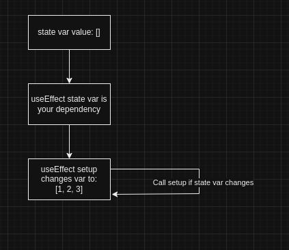

Hello there! On this blog post we are going to have a brief talk about React's UseEffect Hook and some silly thing I have done that caused the UseEffect to keep calling my setup even though my dependency didn't change, or at least I thought.

<!--truncate-->

## Topics
- [Brief explanation of the useEffect Hook](#brief-explanation-of-the-useeffect-hook)
- [A word on dependencies array](#a-word-on-dependencies-array)
- [My Silly Error](#my-silly-error)

Before we dive into the details I would like to say React has a [good documentation on the UseEffect hook](https://react.dev/reference/react/useEffect), I'd recommend that as a source of learning about the hook, here I will be just focusing on the error I made so then enjoy, you beautiful reader!

## Brief explanation of the useEffect Hook

The `useEffect(setup, dependencies)` function is a [React hook](https://react.dev/reference/react/hooks), a hook is a React function that allows you to use React features like state where you want to store the state of a certain variable on every re-render of a component. The useEffect is used to reach out to external services from our React component. 

A good example would be to get data from a REST API so we can display in our component, other tasks would be to do some operations on a file system which is external to our React app, something like reading a file.  

The React useEffect hook is called within the body of a React component or custom hook we defined, it has two arguments `setup` and `dependencies`. The setup is a function we pass that will be called when our useEffect is triggered. The dependencies is an array of dependencies, can be ignore, empty or have a known list of dependencies. 

A simple example of the react useEffect in action would look like this:
```js title="simple-react-snippet-using-useEffect"
const myReactComponent = (props) => {
    useEffect(() => {
        //set up method
        //call api, go to file system, reach out to the DOM
    }, []);

    return (<div>Some Content here</div>);
}
```

We can also optionally return a clean up function in our useEffect hook, a clean up method is a method that is called after the set up is done doing it's task. A clean up function can be used like so:

```js title="simple-react-snippet-using-useEffect-with-cleanup"
const myReactComponent = (props) => {
    useEffect(() => {
        //set up method
        //call api, go to file system, reach out to the DOM

        return () => {
            //body of clean-up
            //do some clean up like closing connections etc.
        }
    }, []);

    return (<div>Some Content here</div>);
}
```

For more info about the clean up method please refer to the [React docs](https://react.dev/reference/react), I don't want to dwell on it here, so sorry. Something I want us to dwell in is the `dependencies` array argument that I have purposefully left of the convo.

## A word on dependencies array
The dependencies array is an optional parameter we pass along with the setup function in the `useEffect` function. The array lists the dependencies that will cause the useEffect to be called when they change, there are some cases that cause the useEffect to behave a certain way, the cases are as follows:

### No dependencies specified:

```js title=no-dependencies-specified
const myReactComponent = (props) => {
    useEffect(() => {
        //set up method
        //call api, go to file system, reach out to the DOM

        return () => {
            //body of clean-up
        }
    }); // no dependencies array

    return (<div>Some Content here</div>);
}
```
When no dependencies are specified this tells React to call the useEffect on every re-render that happens in the component, re-renders are consequence of state changes or page reloads, state variables are specified with [useState()](https://react.dev/reference/react/useState) which I won't dwell on here. This is desirable if you want useEffect to be called when any of state varibales changes for whatever reason.


### Empty dependencies array
```js title=empty-dependencies-specified
const myReactComponent = (props) => {
    useEffect(() => {
        //set up method
        //call api, go to file system, reach out to the DOM

        return () => {
            //body of clean-up
        }
    }, []); //empty array

    return (<div>Some Content here</div>);
}
```
When an empty array is passed this tells React to run the useEffect after initial render of the component and never again, this is ideal for situations where we want to do some **external task** on initial load of the component then never again, like fetching a file once when the component comes up on the screen and never wanting to fetch the file ever again until we remove the component from the view.

### Specifying dependencies
```js title=dependencies-specified
const myReactComponent = (props) => {
    const [message, setMessage] = useState('');
    const otherMessage = '';

    useEffect(() => {
        //set up method
        //call api to save message to db

        return () => {
            //body of clean-up
        }
    }, [message, otherMessage]); //dependency


    //some code that potentially changes the message or otherMessage variables

    return (<div>Some Content here</div>);
}
```

When a dependency is specified this tells React that when this value changes run the code in the useEffect, the useEffect will run once after initial render and again unless the `message` state or `otherMessage` variable changes.   

If you look carefully I have two dependencies, `message` and `otherMessage`, this is to drive an important point, variables that are defined within the component body including props are called reactive variables and are the only objects/variables that can be dependencies to a useEffect, please see [this](https://react.dev/learn/lifecycle-of-reactive-effects#effects-react-to-reactive-values) for more info.

This final case is the reason I did my silly mistake. Let's see how.


## My Silly Error
If we refer to the [previous case](#specifying-dependencies) above we can see that: _When a dependency is specified this tells React that when this value changes run the code in the useEffect_.   

My mistake was I had a state variable which I set as a dependency that got set by the setup code in the useEffact on initial render of the app, after the setup changed my state variable then the useEffect detacted a change on the dependency then called the setup, which caused a change on the dependency again, and the useEffect detected another change and so on and so on.

### A little Diagram To Help
The below diagram shows the high level of how the error works:


To explain what is happening here:
- First I created a state variable and initialized it as an empty array.
- Then I set it as a dependency is my useEffect(), so if this state variable changed, the useEffect will be called.
- The useEffect has a setup method that changes the state variable's value (**this is the bug btw**. I indicated the change here by showing an array with values 1,2, and 3).
- After the initial change, my useEffect realized; **_"hey the dependency has changed, let me call the setup again!"_**. The setup changed the var again and useEffect was like: **_"okay I need to call the setup again!"_**. This continued nonstop and thus the infinite loop 😂

:::tip
The resolution to this issue was to remove the state variable from the dependecy array, as I needed it to be populated on initial render only.
:::

## Conclusion
React offers some useful functions called hooks that allow us to use some React's useful features like state. The useEffect hook is one of those hooks which allows us to do some external tasks that we can't normally do from our React component's code, this includes and not limited to: calling a remote service, reaching out to the DOM, reading a file system. The useEffect uses normal JavaScript/TypeScript code inside it's setup to do tasks.

:::info
A key takeaway would be to avoid changing your dependency from within your setup function. Doing so will cause the `useEffect` to call the setup function repeatedly, leading to an infinite loop.
:::