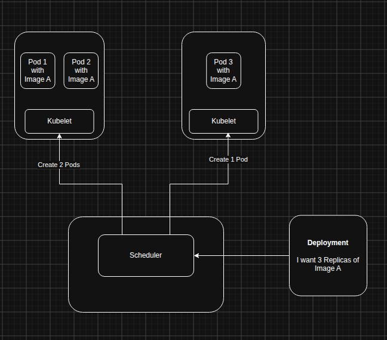

In this post we will be creating and deployig a kubernetes cluster and learn some concepts that help us provision our containerized application in a Node in the cluster. 
This part 2 of the Deploying Kubernetes series, see [part 1](./first-look-at-k8s.mdx).

{/* truncate */}

## Topics

- [MiniKube, the local cluster](#minikube-the-local-cluster)
- [Testing MiniKube and KubeCtl](#testing-minikube-and-kubectl)
- [A Kubernetes Deployment](#a-kubernetes-deployment)
- [Creating a Deployment](#creating-a-deployment)
- Conclusion

## MiniKube, the local cluster

MiniKube is a local Kubernetes cluster that is ideal for running K8s locally for learning and experimenting. 
In this post I will be using it to do what we call a Deployment, but first we will need explain how it works. 

### MiniKube the Docker Cluster

MiniKube works by creating a Docker container inside your host machine, that docker container will act as your cluster.  
We won't focus on the details of the internals, the one thing to take away is:  

- MiniKube creates a container that will act as cluster.
- The container inside has a Node (with Kubelet), Control Plane, and other K8s component.
- By default minikube creates a cluster with only one Node.

For us to interact with the cluster we will use `KubeCtl`. So let's see how to install these programs.  

### Installing MiniKube and KubeCtl.

Before we can start we need both MiniKube and KubeCtl to proceed:

- Install [MiniKube](https://minikube.sigs.k8s.io/docs/start) to have a local cluster.
- Install [KubeCtl](https://kubernetes.io/docs/tasks/tools/#kubectl) to have means to talk to the cluster via command line.
- Install [Docker](https://www.docker.com/get-started/) to be able to run MiniKube container.

With these tools installed we can look at how get started deploying our first application into a Kubernetes cluster.


## Testing MiniKube and KubeCtl

To start with our cluster we will need to start up minikube first with the command:

```bash
# This starts up the minikube cluster on our machine.
minikube start
```

Then we can proceed to check the status of the cluster by the command:

```bash
minikube status

# Expect similar output
minikube
type: Control Plane
host: Running
kubelet: Running
apiserver: Running
kubeconfig: Configured
```

This would mean all is in order for us to start, we can even use KubeCtl to get Nodes:

```bash
kubectl get nodes

# Expect similar output:
NAME       STATUS   ROLES           AGE   VERSION
minikube   Ready    control-plane   14d   v1.35.1
```

This small exercise just hepled us start up the cluster and also we utilized the KubeCtl to talk to our cluster and get us the avaliable Nodes.  

:::note
By default MiniKube creates on Node (VM) that acts as our control plane and will be run our Pod.  
We can specify to have more than one Node, we will see how that is done in the future.
:::


## A Kubernetes Deployment

A Deployment is an object that describes the desired state of running instances of your containerized application.  
It is fed to the `Control Plane` and it tells the `Control Plane` how many instances of a said containerized app (Pods) it wants running.  

The Control Plane's job is to schedule these Pods to be deployed / assigned to the available and healthy Nodes within the cluster.  
It's very important to note that a Deployment doesn't dictate which Node runs the Pods it wants, it just says some many it wants.  

The number of Pods the Deployment specifies is known as `Replicas`. I am using the words instances and replicas interchangebly in this post.

A Scheduler within the Control Plane will be responsible for assigning the replicas to different Nodes, it chooses Nodes based on resource availability.  
Once Scheduled, the Node's Kubelet will pick up the number and image they need to pull and create a containerized app i.e. Pod(s) to run it.  

The Deployment will constantly check with the Control Plane if the desired state is satisfied if it happens it not the Control Plane will need rescheduled Pods.  
This would happen if a Node or Pod goes down, the Scheduler will either need to create Pods in another Node or recreate the crash Pod(s) in the same Node.  

:::note
The reason for the Deployment's desired state to not be satisfied might be:
- A Pod crashes for whatever reason.
- A Node goes down.

The cluster will try by all means to recreate the Pod, find a healthy Node etc.  
If it fails we will have our Pods in a `Pending` state forever.
:::

The image below shows how the whole thing kinda works:
 

## Creating a Deployment
