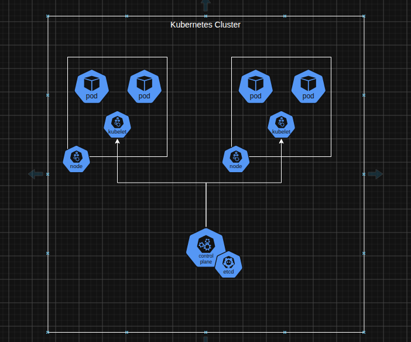

What is Kubernetes (K8s)? We will be exploring some basic concepts behind Kubernetes so we can pretend we know K8s. This post just explores the abstractions Kubernetes provide to us.

{/* truncate */}

## Topics

- [What Is Kubernetes](#what-is-kubernetes)
- [K8s Abstractions](#kubernetes-abstractions)
- [When To Use K8s](#when-to-use-k8s)
- [Conclusion](#conclusion)

## What Is Kubernetes

Kubernetes, sometimes reffered to as K8s, is container orchestration platform, for deploying and managing containerized applications across different machines. 
That sounds fancy, with words like "conatiner orchestration platform" but what does all of that mean? The following sections will explain some abstractions we use in k8s. 

### What Problem Are We Solving with K8s

Kubernetes is trying solve a scaling problem. In the olden days developer teams would buy a server with fixed number of resources (CPU, RAM, Storage, etc.).
When these resources couldn't handle the workload, because of things like burst traffic to the server, scaling meant buying more resouces to support the load. 

Another solution was to have more than one server behind a load balancer of sorts to handle the load. These two solutions are what we would refer to as horizontal and vertical scaling, respectively.
They both work fine but the problem is one can have under utilised resources, in low traffic times, thus a lot of resources sitting stale.  

The other problem is when we need to scale up we need to physically start up VMs, set them up with network configurations, which I imagine is not as quick to do.  

Kubernetes tries to solve this scaling problem by orchestrating the creation / deleting of containerized applications to support demand.

## Kubernetes Abstractions

Below is a picture of a kubernetes cluster, we are going to go through these components to explain what they are used for:  

### Kubernetes Cluster

A cluster is an abstraction that defines the grouping of all the components involved in a kubernetes ecosystem.  
This is a not a physical component but rather a conceptual boundary of all the Virtual Machines, containerized applications that are within our K8s environment.

A cluster is controlled by what we call a `Control Plane`.  

### Control Plane

Sometimes reffered to as the master, this a component of the cluster that controls deployments, deletion of deployments, etc.  
This is what we will be interacting with when we want to provision resources in our K8s environment, the control plane has a small database called the `etcd`.

The `etcd` keeps the state of the cluster like how many Pods are running within a Node. The control plane also has means to communicate with Nodes (Virtual Machines) within the K8s environment.
One more thing to note is that the control is a program that will live in a VM or Physical computer, and we will communicate with it via the CLI tool `KubeCtl`.

We will see how to feed it a config to deploy provision resources in our cluster as we do more parts of this blog post. We spoke about Nodes a lot, let's see what they are.

### Node

Simply put, a Node is a VM or physical computer that is part of your Kubernetes cluster. The Node will have a special program called the `Kubelet` running within it.
The Kubelet is what allows the Node talk to the Control Plane.

The Node's primary role is to run `Pods`, which are simply abstractions for containerized apps.

### Pod

A Pod is an abstraction for containerized application, all the Kubernetes complex set up is made to support this one abstraction. A Pod can have one or more containerized apps running within it.
The idea is that if two apps are so closely related, they can leave within the same pod .i.e Cache app and the Web App that uses that cache app

The pod will be pulling images from some image registry like DockerHub, but we will see how we tell our control plane to do all that.

## When To Use K8s

Honestly K8s is for really big systems that need to scale up and down frequently and also microservices cases where we need to have quick self healing and load.  

For me, I will be playing around in one Node and multiple Pods to get the idea of using K8s in my head.

## Conclusion

In this post we looked at what Kubernetes is, what it is made up of, and what problem it solves. We covered abstractions:

- Control Plane
- Node
- KubeCtl and etcd
- Pods
