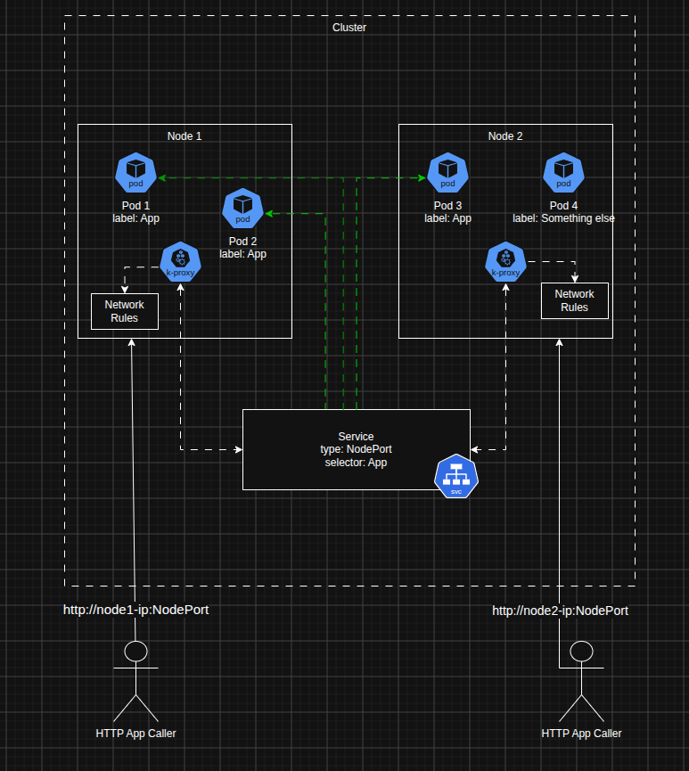

In this blog post we will be looking at how to expose our deployed application via kubernetes' Service object. 
This is a continuation of the K8s series, please the previous two parts: [1](../08/first-look-at-k8s.mdx) and [2](../08/creating-k8s-local-cluster.mdx) for more.

{/* truncate */}

## Topics

- [What Is A Kubernetes Service?](#what-is-a-kubernetes-service)
- [A Look At The NodePort Service](#a-look-at-the-nodeport-service)
- Creating a NodePort Service
- Conclusion

### What Is A Kubernetes Service?

In the previous post we saw that when we deploy our application, Kubernets by default, will create a [private network for the cluster](../08/creating-k8s-local-cluster.mdx#calling-the-deployed-application). What this meant is that we couldn't access our application from outside that network even if we were on the machine that hosted the cluster.  

As a way to test that our application worked and was responding to HTTP calls we resorted to creating a `cluster proxy`.  

Even though this worked it is not practical in a world were we want to expose our app to the outside world and to also add the proxy created a local URL that looked like this:

```bash
http://127.0.0.1:8001/api/v1/namespaces/default/pods/$POD_NAME:8080/proxy/
```
which just looked ugly. Kubernetes Services helps with exposing our application and can be described as:

```text
A Kubernetes Service is an abstraction for exposing a set of Pods externally, provide load-balancing and service discovery for the said Pods. 
```

They are different types of Services in Kubernetes and we will be focusing on the one that helps us expose our app externally.

#### Different Types Of Services

- `ClusterIP` - Exposes an IP that can be used by objects (Pods, etc) within the cluster to call Pods of a certain service - service discovery.
- `NodePort` - Superset of ClusterIP, exposes a port on all Nodes in the cluster that can be used to reach Pods associated with the service.
- `LoadBalancer` - Superset of NodePort, creates an external IP that will route to NodePort Service so we use different Node IPs for calling the application.
- `ExternalName` - OUT OF SCOPE FOR ME AND I AM HAPPY TO SKIP LOL!!

The service type we will be focusing on is the `NodePort` it will help us expose our Pods fine, we can go a step further and use LoadBalancer but that is more cloud specific than local labbing.  

Now let's look at how a NodePort service would look like.

### A Look At The NodePort Service

Below it's a high overview of how I conceptualize the NodePort service setup:  
  

To fully understand what is going on above we need to explain the role of each component in the picture so it is more digestable.  

#### 1. Pods + Service (Green Arrows)

When we create a Deployment we can create labels for the Pods that will be provisioned because of that Deployment, by default a label of the same name as the deployment gets created and attached to Pods of the Deployment.  

A service uses these labels to identify the Pods that we want to expose via our NodePort Service. In the image above we have Pods with label `label=App` and we see our service has a selector with `selector=App`.
This is what the green arrows represent, the linkage of the Pods and the service.

When a NodePort is created it will do the following:

- Create a static port within range `30000 - 32767` and assign it as a port Nodes need to open to access Pods with the label matching the selector.
- An `Endpoints` object will be created, which will have the list of all Pod IPs and Port (TargetPort) that have a matching label with the selector.

The Pod IPs are useful for the next step.

#### 2. Kube-Proxy Role (Broken Arrows Within Cluster)

The Kube-Proxy shown as k-proxy in the diagram is a very pivotal part of how the NodePort Service works, it is a daemon that runs on every Node in the cluster.  

It is responsible for writing Network rules that proxy requests relevant Pods, it does that by looking up the `Endpoints` object.
The Kube-Proxy will get all the list of Pod IPs in the `Endpoints` object then create Network rules (using NAT, ip tables, etc) to forward traffic to the correct Pods.  

The broken arrows just show that the Kube-Proxy interacts with Service to get associated `Endpoints` object so it can create the Network rules.

:::info
**The Kube-Proxy Doesn't Proxy Requests**

One important detail to keep in mind is that the Kube-Proxy doesn't really "proxy" requests from the Node to the Pods. It's job is to just create the network rules, the network layer of the Node will be responsible to proxy to the Pods.
:::

#### 3. Calling the Nodes (Reaching into the Pods)

The final bit is the human actors in the diagram above, one can see that to access the application the user actually call these URLs:

- `http://node1-ip:NodePort`
- `http://node2-ip:NodePort`

Where `NodePort` would be the port that was assigned by the NodePort Service for each Node (it's the same value).  

This means that callers use the Node's IPs (i.e the VMs or Machines) and importantly use the port that is associated with the Service, this way the network rules will kick in and pass the request to the appropriate Pods.  

Kubernetes uses `NAT(Network Address Translation)` to do the proxying, out of scope for this post but worth a mention.   

The 3 breakdowns show how NodePort achieves proxying into the Pods by going through the Nodes.

:::info
**Pods Don't Need To Be The Node**

As we know in a K8s cluster Pods for a certain application can be in one Node if the scheduler provisioned them that way.  

So even if the caller calls the NodePort by using Node IP of a Node that doesn't have the app associated with NodePort service, K8s will still find the correct Pods.  

This is because the NodePort applies to **ALL THE NODES IN THE CLUSTER**, if node doesn't have the Pod it will just send to the Pod IP in another Node.
:::


