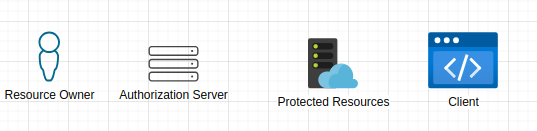
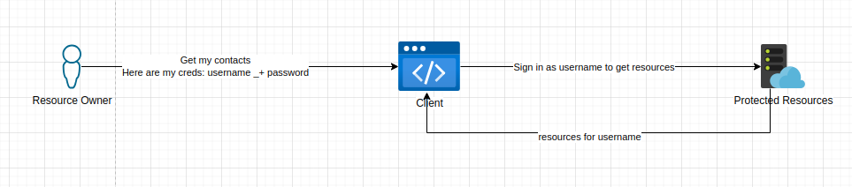
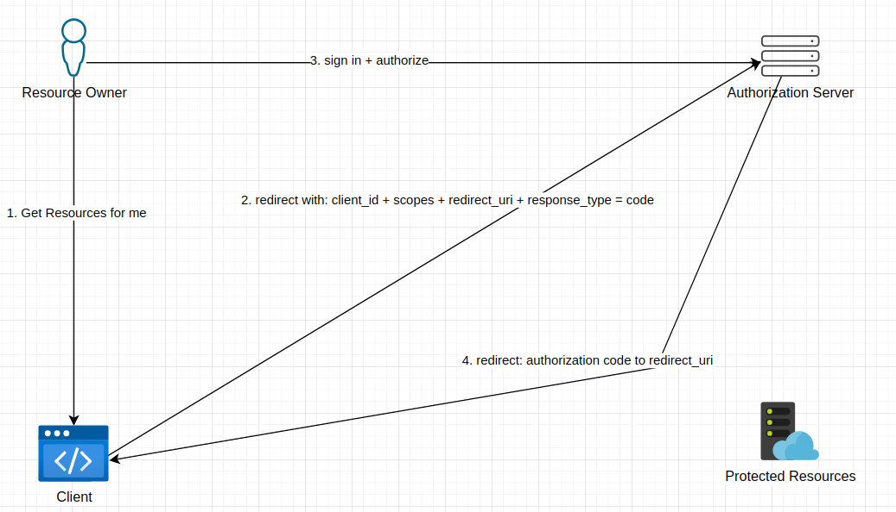
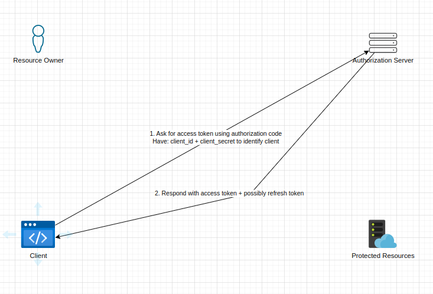
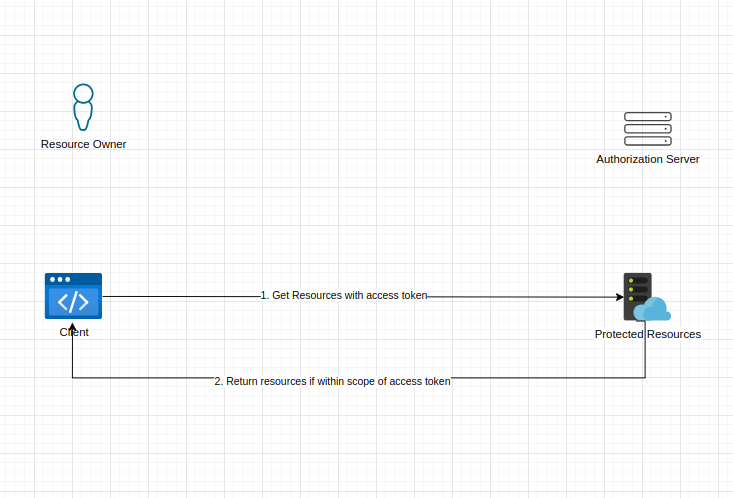

<!--truncate-->

Hello there, I recently started reading about OAuth and trying to understand it as framework idenpendent of a coding framework/SDK/Package and/or 3rd party offerings.  
In this post I will be talking about the OAuth Authorization Code Flow and why I think it is just an amazing framework for delegating user data, sit back and relax as we pretend our way through OAuth.  

### Topics
- What is OAuth?
- Why We Use OAuth and How It Benefits us
- OAuth Flow: Authorization Code Flow
- OAuth Server in .NET

### What is OAuth?
Open Authentication commonly referred to as OAuth is a means of authenticating an application to access a resource owner's data from a different application.
It provides a standardized framework that allows this data sharing to be secure, easily adoptable and easily extensible, while providing flows that make sense for different use cases like mobile, native or web applications to name the least.  

To understand what is OAuth we will need to travel a while back in time and see what kind of problem OAuth was trying to solve in the first place, using a use case where we have two application that need to share data on behalf of a user.

#### Actors In OAuth
In this small section I will just add terms to some actors that are involved in OAuth:

- `Resource Owner` - This is what we have been refering to as the user so far, this is the person/entity that owns the data we are interested in.
- `Client` - This is the application that wants to access the resource owner's data, in this example this is the MessageWriter service.
- `Authorization Server` - We haven't spoken about this component but it is important to OAuth, this is the component that is responsible for authenticating the resource owner and issuing out tokens to client application.
- `Protected Resource` - This is where the requested data resides, this will be thought to be an REST API in this blog post.

Will come back to these later and explain their role in OAuth in depth for now let's keep the terms in mind. Now let's look at how our data sharing problem would've been solved back in the day.

#### Problem OAuth is Solving: Replaying Password
In the olden days if a client wanted to access data on behalf of the user, the user would need to give their password and username to the client so that the client can replay signing in as the user as shown below:

This has a lot of security implications what if the client loses your credentials and they end up in the wrong hands?

Another security implication would be the resource application has no way of distinguishing between the resource owner and the client. Another one is, since the client signs in as the resource owner, they also have access to resources that they shouldn't and can before more actions like deleting, modifying and sharing resources when they shouldn't.

The above problem is one the big reasons OAuth was implemented, for scoping application's permissions on the resource owner's content and making sure there is no credentials sharing that can expose the resource owner to potential malicious acts.

## Simple Use Case: Writing Messages
Let's pretend we have an application that stores contacts on the cloud, let's call it `ContactSaver` and a user wants to write messages for their contacts whenever it's their birthdays but the service that writes these messages is separate from the contacts application, let's call it `MessageWriter`. Looking at this, we may think "oh I have a cloud service: ContactSaver that my MessageWriter application can use to get contacts then write birthday messages for me 🙂", the catch: How do we let MessageWriter get ahold of the contacts in ContactSaver on behalf of the user so it can write it's messages.  

This simple use case gives rise to the need of data sharing across applications on behalf of the user. Let's see how OAuth with Authorization Code Flow can help us with this problem.

## OAuth: Authorization Code Flow
In OAuth we have different ways to implement delegation of the resource owner's data, this is usually referd to as `OAuth Flow`. Different flows are useful for differnt user cases, we will be looking at the [authorization code flow](https://datatracker.ietf.org/doc/html/rfc6749#section-1.3.1). This flow is useful Web Application that want access the resource owner's content, it's ideal if the Web Application doesn't run on the browser like a SPA application, this is more suitable for REST APIs or server rendered web apps.

:::note
The reason Authorization Code Flow is useful for Web Apps running on a remote server is because there is some compile time configuration like client secrets that the server needs to have exchange it's code for an access token. This can be hard to be achieved in javascript clients running on the browser because we can't hide these secrets from the browser, please see [Implict Grant Flow](https://datatracker.ietf.org/doc/html/rfc6749#section-1.3.2) for this use case.
:::

### How Authorization Code Flow Works
In the simplest terms for this flow to work, the resource owner has authorize the client's request to access their data. The client should know what kind of rights (scopes) they need. When they have been authorized a code will be given to the client known as the `authorization code`.  
The client will then need ask the authorization server for an exchange of this code with an `access token`. An access token is then allows the client to send a request to the `Protected Resources` endpoint.

This is just a simple overview let's see how that can be achieved. With the below diagrams. We will talk through each important processes piece by piece to form the whole picture.

For the below example we will assume the client is using the browser to communicate with the other actors.

#### 1. Getting Authorization Code:

- Firstly the user will be asked by the application if they want the client to get resources on their behalf.
- If they agree then step 1 is done.
- The client will then redirect the resource owner to the Authorization Server with the following query parameters: `client_id`, `scopes`, `redirect_uri` and `response_type`appended on the redirect url.
- the `response_type=code` indicates to authorization server that the clients wants a authorization code thus using the authorization code flow.
- The client will have had the `client_id` issued to them by the authorization server when the client registered to use the protected resources OpenAPI.
- When the resource owner is redirected they will be asked to authenticate themselves with the authorization server, this all happens without the client application seeing anything thus no way to see the resource owner's credentials.
- Once authenticated the resource owner will be presented with a page that shows the `scopes` that the client application needs to preform whatever tasks it wants, at this point the resource owner can approve or reject this request.
- If approved the authorization server will redirect the resource owner to client's `redirect_uri` and append the authorization code on the url with the parameter `code` that will have some opeque code like `code=sgysbcAhbdfj...` which is authorization code.
- The `redirect_uri` will have been the same redirect_uri that the client registered when it registered to use the OpenAPI. This adds a level of security because the authorization server will always redirect to the url the client knows and can read from, not just anyone can inject their own redirect_uri.
- The client doesn't need to understand the authorization code it just needs to know how to use it to exchange for the access token.

As seen above the client application and the authorization server communicate indirectly through redirects with the browser being the middle man. This separation is essential to OAuth because makes the client a simple component in the framework and gives all the authentication and authorization related functionality to Authorization Server

:::note
//Add note aboute state parameter
:::

//Add section about client registration

#### 2. Getting The Access Token
Once a client has the authorization code, the client will need to trade this for an access token. The client will typically have some kind of identity i.e. `client_id` and some `client_secret` that will be sent along with the authorization code. This will help the Authorization Server identify the client if it is to be trusted to be given the access token. Here is the flow:

- client would have extracted the authorization code from the redirect respond in [getting-authorization-code](#1-getting-authorization-code) 
- Then send an HTTP POST to the Authorization Server with it's `client_id` and `client_secret` as form of identitification. How this identification is done i.e. HTTP Basic Auth or some flow like client credentials, doesn't really matter as long as there is this identification.
- The Authorization Server will process the request and do some checks to verify the code is still valid, the client is who they claim to be, etc.
- If all is well an access token we will be sent backk to client with some extra data like `expiration time`, `refresh token`. What kind of extra data the Authorization Server returns is totally up to the Authorization Server.
- Once the client receives the access token which like the authorization code is opeque to the client, the client will be ready to make calls to `Protected Resource`.

A nice thing about this flow is since the access token and authorization code is opeque, the client doesn't even know which user it is delegating for because it doesn't need to. It knows that it needs an access token that the Protected Resource can understand. This again just shows how OAuth has made the client as dump as possible to the point it can easily if ever be exposed to data that can be sensitive.

Another thing is since the Authorization Server oversees the access responsibility the resource owner only needs to go to one place to revoke the access if needed. Now that is good security right there.

note:::
The client would have registered with Authorization Server so that it can be able to delegate calls for resource owners. Apon registration a `client_id`, `client_secret` and `redirect_uri` are configured for the client.
:::

#### 3. Calling the Protected Resource
Now that the client has the access token it can then use it to get the protected resources scoped to what `scope` was requested in the intial call to create the authorization code. The `Protected Resource` endpoints will have enough context to know which user the access token is for and what kind of data can the client ask for. The Protected Resource can even do extra validation to make sure the access token has expired or been tempared with.

Here is the diagram:

- The client will send the a request to perform an action (read, edit, post, delete) with an access token attached to the request.
- If the action is within the scopes of the access token and the access token is still valid, the Protected Resource will respond gracefully and fufil the request.
- If the action is not within the scopes of the access token or the access is not valid the Protected Resource will have to kick back to client with anything like 4xx status code.

This will be all to get resources on behalf of a resource owner with OAuth's Authorization Code Flow.

## Conclusion 
