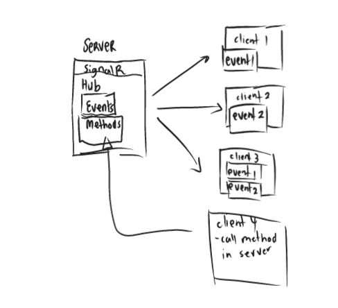
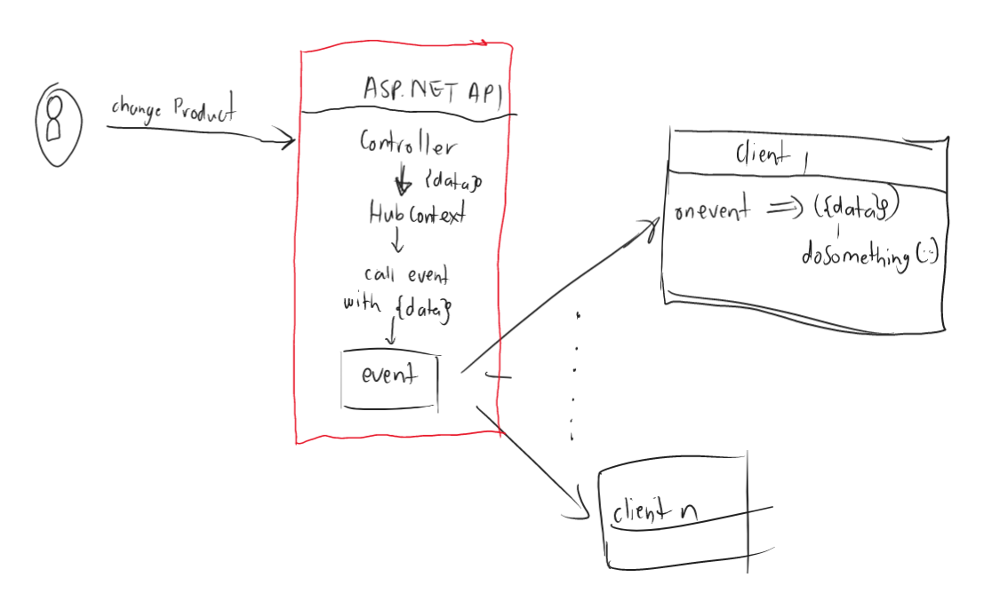

<!--truncate-->

Hey there it's been a while since I did a blog post. In this post I will be looking into SignalR and it helping us do real time updates!
The code referenced here will be from this [repo](https://github.com/Takobz/signalr-example)

<!--truncate-->

### Topics
- What is SignalR ?
- Why Should I use it ?
- Set up to use SignalR (Server-side)
- A mini project with concepts: What are Hubs, Events and Methods in SignalR
- Doing updates from services with IHubContext.
- Conclusion

### What is SignalR ?
Before we even start looking at SignalR I think it would be cool to understand what it is and what does it do. 

SignalR is .NET's solution to allow servers to send information to clients as soon the change happens in the server. Both the client and the server can invoke methods on each other. This allows the server to call the client thus tell the client about the changes it is interested in. A client can subscribe to changes, called events.

The image below shows the typical architecture of SignalR:


The image above shows some of the fundamental parts of SignalR. We have a `server` that has SiganlR. Which in turns has a Hub which has Events and Methods. Note, a Hub has events and methods in it.

A `Hub` exposes our signalR endpoints. It enables clients to communicate with the server and vice-versa.

`Events` are the type of actions that clients can subscribe to. So whenever an event happens in the server a client that is subscribed to it will get notified on change. Note that a client can subscribe to multiple events as we can see client 4 from the image.  

`Methods` these are functions on the server/Hub that can be called from the client side code. The client should provide the appropriate parameters and method name to invoke the correct method. 

:::note
The Hub methods can be used to indirectly cause an event from the client on the server but they are not necessarily for firing events from a client but can be used for that function. It's calling a function from your client called in your server code.
:::

### Why Should I use it ?
There are number of reasons to use SignalR but my number one take is live updates. If you have an app that needs to know of changes as soon as they happen (chat notification or live updates like order tracking) then you might need to consider SignalR.  

Why? Well imagine you have an app that needs live data from your database as soon as the state of the database changes. One way to do this is polling, where your app will call the server every, say 60 seconds. This will definitely work until we have a lot requests to the server and potentially causing many request errors and slowing down our server.  

Another big win is that clients can choose what is important to them and listen to those events and then inform other clients of their changes.  

### Set up to use SignalR

###  A mini project with concepts: What are Hubs, Events and Methods in SignalR
Now, the action! In this section we are going to explore some key conecpts with code snippets! 🐱‍🏍

#### Problem Statement:
We want to have some frontent clients notified whenever a change happens on a certain table that we have in our database. So differnt client apps can subscribe to a signalR change event of any table they are interested in and we will notify them when there is a change. 

#### Set Up:
The .NET Solution will have an ASP.NET Web API with .NET 7. The frontend will be a simple React App that just listens to events.
The database will be sqlite database, to query the database we are going to use Entity Framework Core. Simple stuff 😉.  

Our server will be our ASP.NET Web API and our client a React App. It is worth to mention that a client can also be another ASP.NET Web API.

Here is a mini diagram of flow:  


We are simply going to have a controller that does a database table change then uses the Hub to fire an event that a table has changed.

##### Set Up SignalR in ASP.NET:
- In our Program.cs file we need to add our hub dependencies to service collections with this line: `builder.Services.AddSignalR()`
- Create [Hub folder](https://github.com/Takobz/signalr-example/tree/main/signalr-example/Hubs) in the root of our project called Hubs as I did in my repo
- Inside the folder create a file called `DatabaseHub.cs`. This folder will have our Hub class and interface that describes our events.
- Then in our Program.cs we map a url to our Hub with this line: `app.MapHub<DatabaseHub>("/database-hub")` this means our hub url will be like this `https://localhost:<port>/database-hub`

This should be enough for a set-up no eventing yet but first steps.  

##### Hub Class
A Hub is a server concept in SignalR terms. It simply just represents a signalr server. This will be a normal c# class that extends the `Microsoft.AspNetCore.SignalR.Hub<T>` 

The Type `T` is an interface that has all the events the Hub can expose.

Hub Example:  
```csharp
using Microsoft.AspNetCore.SignalR;

namespace SignalRExample.Hubs;

//Hub
public class DatabaseHub : Hub<IDatabaseHubEvents>
{
    //This is a method, it can be called from the client's code.
    public async Task NotifyAll(string clientName)
    {
       //I can cause an event in here by calling Clients property.
       //or something unrelated to SignalR.
    }
}

//Events Interface
public interface IDatabaseHubEvents
{
    //Event we are going to fire when Product table changes.
    Task ProductTableChanged(TableChangeModel changeModel);

    //Event we are going to fire when Person table changes.
    Task PersonTableChanged(TableChangeModel changeModel);
}

//Just a model
public class TableChangeModel
{
    public string TableName { get; set; } = string.Empty;
    public int ItemId { get; set; }
}
```

When an event `ProductTableChanged` is fired clients that are subscribed to the event will receive a `TableChangeModel` object which has the data TableName and ItemId. 

We will see how that is done on the client side later but for now. This will be enough. I want us to talk about the `Clients` property in Hubs namespace

##### SignalR Hub Clients 
`IHubCallerClients<T> Clients` This property has the ability to call all clients that are subscribed to an event. It also has the capability to group client calls:

- Clients.All - calls all clients that are listening to an event.
- Clients.Groups - calls a certain group of clients

This is what we will use to cause events. We can edit the above code to be like this:
```csharp
public class DatabaseHub : Hub<DatabaseHubMethods>
{
    //Notify every client that subscribed to this event.
    public async Task NotifyAll(TableChangeModel changeModel)
    {
        //Send changeModel to All subscribed clients
        //Note we are causing an Event inside a Method, we don't need to do this all the time
       await Clients.All.ProductTableChanged(changeModel);
    }
}
```
:::note
In this blog we are going to Call all clients for more info on how to scope groups for more info on how to scope SignalR events visit this [Microsoft page](https://learn.microsoft.com/en-us/aspnet/core/signalr/groups).
:::


##### Entity Framework Models
We will have simple EFCore models that represent tables in our database.  
- ProductModel:
``` csharp
public class Product
{
    public int ProductId { get; set; }
    public string ProductName { get; set; }
    public string ProductDescription { get; set; }
}
```
- PersonModel:
``` csharp
public class Person
{
    public int PersonId { get; set; }
    public string Name { get; set; }
    public string Surname { get; set; }
}
```  

For Data Models and set up, please see [Repo](https://github.com/Takobz/signalr-example)

### Causing An Event To Fire 🔥
For us to cause an event to fire we just need to call the `Clients.All.<my-event-function>` So we are going to create a Controller that can be POSTED or PUT into and then it will fire an event after a successful modification.  

Here is the Controller:  
```csharp
public class SignalRController : ControllerBase
{
    private readonly IHubContext<DatabaseHub, IDatabaseHubEvents> _dbHubContext;
    private readonly ISignalRDbContext _signalRDbContext;

    SignalRController(
        IHubContext<DatabaseHub, IDatabaseHubEvents> dbHubContext,
        ISignalRDbContext signalRDbContext)
    {
        //make sure you have registerd IDatabaseHubEvents in the DI container
        //i.e services.AddSingleton<IDatabaseHubEvents, DatabaseHub>()
        _dbHubContext = dbHubContext;
        _signalRDbContext = signalRDbContext;
    }

    [Route("/add-person")]
    [HttpPost]
    public async Task<IActionResult> AddPerson(string name, string surname)
    {
        if (!string.IsNullOrEmpty(name) && !string.IsNullOrEmpty(surname))
            return BadRequest("user must have name and surname");

        var person = new Person
        {
            Name = name,
            Surname = surname
        };
        DatabaseResult<Person> result = _signalRDbContext.AddPerson(person);
        if (result.Status == Status.Success)
        {
            var changeModel = new TableChangeModel 
            {
                TableName = "Person",
                ItemId = result.Data.Id
            }

            //Calling all clients and giving them the change model.
            await _dbHubContext.Client.All.ProductTableChanged(changeModel);
            return Ok("User Added and alerted subscribers!")
        }

        //generates appropriate response based on database result
        return GenerateResponseBasedOnStatus(result);
    }
}
```

In the above we register our Hub via IHubContext interface and our DbContext that is behind an interface. The important line here is:   
`await _dbHubContext.Client.All.ProductTableChanged(changeModel);` this lines calls subscribed clients by firing an event `ProductTableChanged` thus passing down the TableChangeModel data can be used by all the subscribed clients.  

And that's it, that's how you fire an event. For all the controller source code check out: [SignalR Example Repo](https://github.com/Takobz/signalr-example/tree/main/signalr-example/Controllers).

### Configurig A Client App
